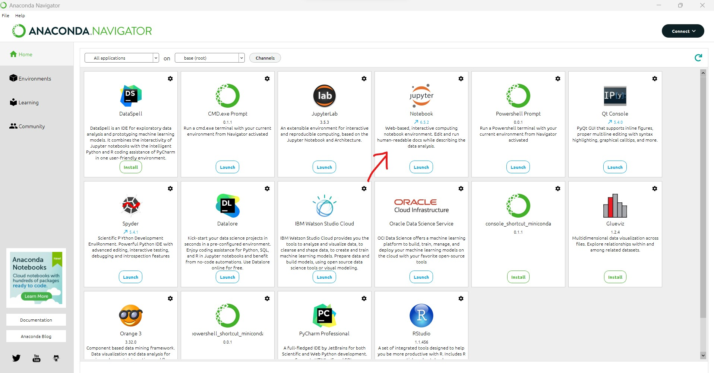

# Installing Python and Jupyter Notebook

## Installing Python

In order to write and execute Python code, you will need to install both Python and Jupyter Notebook. Depending on which operating system you are running on your system, the installation procedure may vary.

::::{tab-set}
:::{tab-item} Windows

**Installing Python**

Install the latest version of Python for Windows [here](https://www.python.org/downloads/windows/). 

Download the Windows installer based on your operating system (most modern computers use 64-bit). Once the executable file download is complete, open it, click on Run, and the installation process will start.

**Installing Jupyter Notebook**

You can use either pip or Anaconda to install Jupyter Notebook on Windows. It is recommended that you use pip ("Package Installer for Python"), to install Jupyter Notebook, but we provide instructions here for Anaconda, if pip does not work on your system.

**Installing Jupyter Notebook via pip**

* Step 1: Open Command Prompt and execute the command  ```pip --version```  to check whether pip is installed. If not, you will need to install pip through some other method, or try using Anaconda.

* Step 2: If pip is already installed, you need to execute the command  ```python -m pip install jupyter``` to complete the Jupyter Notebook download and installation of all files and packages.

* Step 3: Execute the command  ```jupyter notebook```  to launch Jupyter Notebook.

**Installing Jupyter Notebook via Anaconda:**

* Head over to [anaconda.com](https://www.anaconda.com/download#windows) and download the Anaconda installer file. Run the installer file and follow the wizard to install Anaconda.



* Search for Anaconda Navigator from the Start Menu. After Anaconda Navigator launches, click the Install button under Jupyter. Wait until the Jupyter Notebook installation is completed. Then, the Install button will turn to a Launch button. Launch it for use.
* When launching Jupyter Notebook from Anaconda, notebooks will be saved to the default folder of Anaconda Powershell Prompt. To save the notebooks to a different folder, follow these steps:
* launch Anaconda Powershell Prompt
* Type  ```cd ```  to move the working directory to the folder of your choice
* Type  ```jupyter notebook```  and it will start the server from your folder

:::

:::{tab-item} Mac OS
Instructions Here
:::

:::{tab-item} Linux
Chances are, if you are running Linux, you are already familiar with the command line and your distribution's package manager 😎.

**Installing Python**

Depending on your distribution and package manager, installation of Python3 may vary. For Ubuntu-like distributions, the latset version of Python can be installed with:

```
sudo add-apt-repository ppa:deadsnakes/ppa 
sudo apt install python3.11
```

Additional steps may be needed to install pip, the Python package manager.

**Installing Jupyter Notebook**

To install Jupyter Notebook, you will need to install it via pip:

```
pip3 install jupyter
```

or on some systems:

```
python -m pip install jupyter
```
:::
::::
