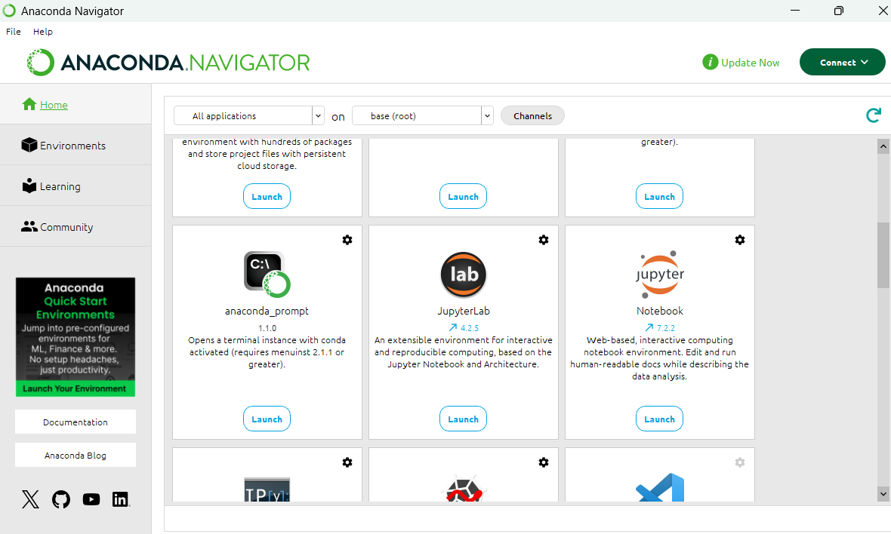
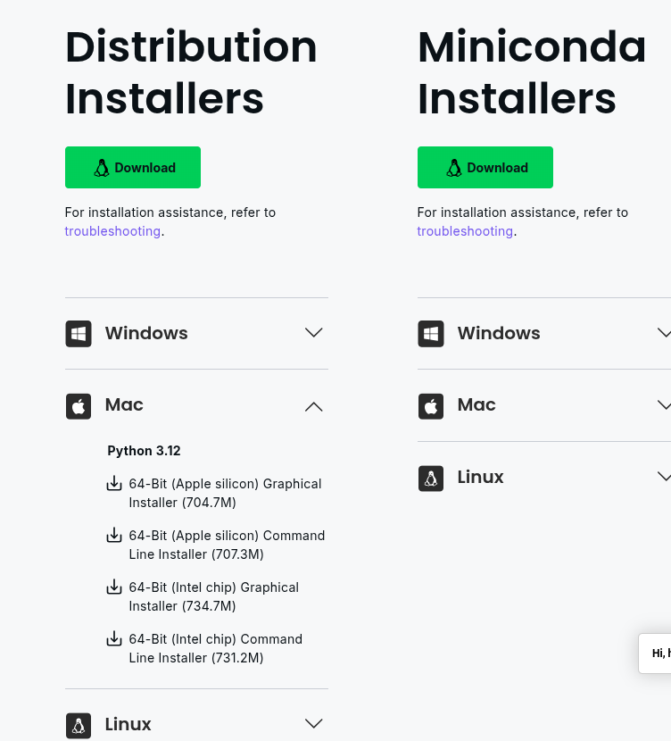

# Installing Python and Jupyter Lab

In order to write and execute Python code, you will need to install both Python and Jupyter Lab. Depending on which operating system you are running on your system, the installation procedure may vary.

::::{tab-set}
:::{tab-item} Windows

**Installing Python**

Install the latest version of Python for Windows [here](https://www.python.org/downloads/windows/).

Download the Windows installer based on your operating system (most modern computers use 64-bit). Once the executable file download is complete, open it, click on Run, and the installation process will start.

**Installing Jupyter Lab**

You can use either pip or Anaconda to install Jupyter Lab on Windows. It is recommended that you use pip ("Package Installer for Python"), to install Jupyter Lab, but we provide instructions here for Anaconda, if pip does not work on your system.

**Installing Jupyter Lab via pip**

* Step 1: Open Command Prompt and execute the command  ```pip --version```  to check whether pip is installed. If not, you will need to install pip through some other method, or try using Anaconda.

* Step 2: If pip is already installed, you need to execute the command  ```python -m pip install jupyter``` to complete the Jupyter Lab download and installation of all files and packages.

* Step 3: Execute the command  ```jupyter lab```  to launch Jupyter Lab.

**Installing Jupyter Lab via Anaconda:**

* Head over to [anaconda.com](https://www.anaconda.com/download#windows) and download the Anaconda installer file. Run the installer file and follow the wizard to install Anaconda.
* Search for Anaconda Navigator from the Start Menu. After Anaconda Navigator launches, click the Install button under Jupyter Lab. Wait until the Jupyter Lab installation is completed. Then, the Install button will turn to a Launch button. Launch it for use.



* When launching Jupyter Lab from Anaconda, notebooks will be saved to the default folder of Anaconda Powershell Prompt. To save the notebooks to a different folder, follow these steps:
* Launch Anaconda Powershell Prompt
* Type  ```cd <your folder>```  to move the working directory to the folder of your choice
* Type  ```jupyter lab```  and it will start the server from your folder
* Alternatively, you can use the command:

```
jupyter lab --notebook-dir C:\Path\to\your\folder
```

:::

:::{tab-item} Mac OS

It is very likely that your Mac already has a version of Python installed, but it is helpful to get the latest Anaconda Mac OS package. This will get you the following:
* The most recent version of Python3
* An installation of Jupyter Lab
* Several other data science Python packages

```{tip}
_Testimony of a Mac user:_
As a Mac user, I've had the *most success* with the *command-line* installation, rather than the graphical installation. I've found this to better support the subsequent installation of packages using `conda install <package-name>`. Therefore, these instructions guide you through the command-line installation. This means that you will download the installer from the website, and then complete the installation in the terminal rather than using your mouse/trackpad.
```

1. Download the Command Line installer that is appropriate for your Mac's processor.
   * To get the Command Line installer, visit the Anaconda [download page](https://www.anaconda.com/download#downloads).
   * Scroll down as needed (you might not need to) toward the bottom (or search the page for `command line`) so that you find this:
   
   * Choose the appropriate installer for your Mac processor from the "Mac" column.
2. Use your Mac terminal to follow the [Command-line installation instructions](https://www.anaconda.com/docs/getting-started/anaconda/install#mac-os-command-line-installer).
   ```{note}
   The linked instructions are from 2024, so you'll have to use the updated name of the Anaconda installer (i.e., not `~/Downloads/Anaconda3-2024.10-1-MacOSX-arm64.sh`)
   ```
   * To access your Mac terminal, use the Mac OS search feature ("Spotlight") and enter `terminal`.
:::

:::{tab-item} Linux
Chances are, if you are running Linux, you are already familiar with the command line and your distribution's package manager 😎.

**Installing Python**

Depending on your distribution and package manager, installation of Python3 may vary. For Ubuntu-like distributions, the latest version of Python can be installed with:

```
sudo apt install python
```

Additional steps may be needed to install pip, the Python package manager. For Ubuntu-like systems, this can be done with:

```
sudo apt install python3-pip
```

**Installing Jupyter Lab**

To install Jupyter Lab, you will need to install it via pip:

```
pip3 install jupyter
```

or on some systems:

```
python3 -m pip install jupyter
```

You can also install packages through [Anaconda on Linux](https://docs.anaconda.com/free/anaconda/install/linux/), though this is usually not needed on Linux systems.
:::
::::
