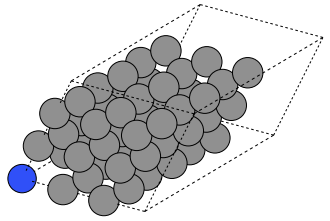

---
jupytext:
  text_representation:
    extension: .md
    format_name: myst
kernelspec:
  display_name: Python 3
  language: python
  name: python3
---


# ASE - The Atomic Simulation Environment

The [Atomic Simulation Environment (ASE)](https://wiki.fysik.dtu.dk/ase/) is a versatile, open-source Python toolkit designed to simplify the full lifecycle of atomistic simulations. With ASE, you can easily construct and edit representations of molecules, crystals, and low-dimensional materials. It provides interfaces to a wide range of simulation engines, enabling you to perform calculations at various levels—from quantum mechanical density functional theory to classical molecular dynamics. ASE also streamlines tasks like launching simulations, parsing results, and visualizing structures and trajectories, making it a solid framework for materials modeling and exploratory research.

ASE can interface with a variety of simulation software platforms including [VASP](https://www.vasp.at), [Quantum ESPRESSO](https://www.quantum-espresso.org), [Q-Chem](https://www.q-chem.com), [Gaussian](https://gaussian.com), and others (see the [full list](https://wiki.fysik.dtu.dk/ase/ase/calculators/calculators.html#supported-calculators)) through tools called calculators. ASE can create input files, launch simulations, and parse the output. ASE has a vast set of modules and functions, giving it vast and powerful functionality. We will only scratch the surface in this brief tutorial.

## Installation
To get started with ASE, you first need to install the Python package. If you installed all of the required dependencies at the beginning of this book, you should have the `ase` package already installed. Otherwise, you can install it with the command:
```
pip install ase
```

## Usage

ASE is designed to simplify atomistic modeling by separating the creation of structures from the actual simulations. A typical ASE workflow involves two main steps:
1. *Creating an `Atoms` object*: This represents your molecule or material.
2. *Attaching a calculator*: This defines the simulation backend to compute energies, forces, or other properties.


:::{Note}

Performing atomistic simulations are beyond the scope of this workshop. Here, we will show you the basics, such as how to create and manipulate an `Atoms` object. More information about performing simulations using `Atoms` and `calculator` objects may be found on the ASE documentation page [Atoms and Calculators](https://wiki.fysik.dtu.dk/ase/gettingstarted/tut01_molecule/molecule.html).
:::

## Making `Atoms` Objects
The `Atoms` object in ASE is the core structure used to represent physical systems. It consists of one or more `Atom` objects, with attributes such as `symbol` (string), and `position` (a 3-element tuple of Cartesian coordinates, in Angstroms). Other atomic properties can be specified, such as `mass`, `charge`, etc.

## Building Simple Molecules

Let's start by importing the ase package and building a simple molecule. To build simple molecules, ASE provides a convenient `molecule()` function. It allows you to quickly generate common molecules by specifying their chemical formula as a string. The resulting Atoms object can be visualized in 3D, offering an intuitive understanding of molecular geometry.
```{code-cell}

from ase.build import molecule
from ase.visualize import view

# build an ase.Atoms object to represent a water molecule
water = molecule('H2O')

# make an interactive, 3D visualization of the molecule
view(water, viewer='x3d')
```

The `molecule()` function is provided as a simple way to build an `Atoms` object. Here, a molecule is specified using a Python string containing a chemical formula, and only a very limited set of molecules are supported. The list of available molecules is found in the `ase.collections.g2.names` list:

```{code-cell}
from ase.collections import g2

# print the ase.collections.g2.names list
print(g2.names)
```

Additionally, by iterating over the atoms in the structure, you can extract and print coordinates, giving a clearer view of the atomic configuration, which is useful for custom analysis or manual editing.

Let's build a [formic acid molecule](https://en.wikipedia.org/wiki/Formic_acid) and print the x, y, and z coordinates of each atom:
```{code-cell}
# construct a formic acid molecule
atoms = molecule('HCOOH')

# print the symbol and coordinates of each atom.
print('Show atomic coordinates:\n')
for atom in atoms:
    x, y, z = atom.position
    print(atom.symbol)
    print(f'  x: {x} Å')
    print(f'  y: {y} Å')
    print(f'  z: {z} Å')
```

We can still make an interactive 3D visualization:

```{code-cell}

# 3D visualization
view(atoms, viewer='x3d')
```

Having constructed an `ase.Atoms` object to represent water molecule, we could create a `calculator` object to run a simulation.

## Building Complex Molecules

For more complex molecular systems, ASE supports importing atomic structures from external sources. You can:
* Construct a molecule from a structure file (`*.cif`, `*.xyz`, etc.)
* Read the structure from simulation output
* Obtain a structure from a molecular database

Use the `ase.io.read()` function to load structures into an Atoms object. This approach is especially powerful when dealing with large, experimentally-derived or computationally-relaxed molecules. You can also export structures to one of many different file formats using the `ase.io.write()` function. For more information take a look at the [`ase.io` documentation](https://wiki.fysik.dtu.dk/ase/ase/io/io.html).

## Building Simple Crystals - Bulk Silicon

ASE includes tools to create bulk crystals using known crystal structures and lattice parameters. The `bulk()` function allows you to specify an element and lattice type (e.g., `'fcc'`, `'bcc'`, `'diamond'`). This returns an `Atoms` object with a unit cell that can be visualized or expanded into supercells. Visualizations can be saved as static images using `ase.io.write()`, or viewed interactively in 3D. These tools are great for exploring crystal symmetry and preparing inputs for electronic structure calculations.

Now let's build a periodic Silicon crystal. Silicon crystalizes in a diamond structure, which we can make with the `bulk()` function:
```{code-cell}

from ase.build import bulk
from ase.io import write

# construct bulk silicon
atoms = bulk('Si', 'diamond')

# export visualization as a static PNG image
write('silicon_basis.png', atoms, show_unit_cell=2)

```

This renders structure as a simple PNG image:

```{image} silicon_basis.png
:alt: silicon_basis.png
:width: 100px
:align: center
```

We can also make an interactive 3D viewer:

```{code-cell}

view(atoms, viewer='x3d')
```

## Building a 2D System - a MXene

The `ase.build` module provides functions for building 2D structures. For example:
* `graphene_nanoribbon()` may be used to make graphene nanoribbons and graphene sheets.
* `mx2()` may be used to build [MXene](https://en.wikipedia.org/wiki/MXenes) and [transition metal dichalcogenide](https://www.sciencedirect.com/topics/materials-science/transition-metal-dichalcogenides#:~:text=TMD%20monolayers%20are%20structurally%20of,octahedral%20or%20trigonal%20prismatic%20coordination.) (TMD) monolayers.

These functions generate primitive unit cells with proper vacuum spacing to simulate surface effects. For simulations using periodic boundary conditions, a vacuum gap in the z-direction avoids artificial interactions between layers. You can also tile these unit cells to form supercells by multiplying the structure in the desired directions, enabling simulations of extended sheets.

Let's write some code to build the MXene Ti$_2$C. Since a structure like this would likely be used in a DFT calculation, and DFT calculations often have periodic boundary conditions, the unit cell features a large air gap to keep separate the main sheet from its images in the z direction. A vacuum of 15 Angstroms should be sufficient:

```{code-cell}
from ase.build import mx2
from ase.io import write
from ase.visualize import view # 3D interactive image

# This forms a primitive unit cell
Ti2C = mx2('CTi2', vacuum = 15)
```

We can also expand the unit cell to a supercell by repeating the unit cell in space. To repeat the primitive cell described by the `Ti2C` object, we simply multiply `Ti2C` by a 3-element tuple. The three integers `(nx, ny, nz)` repeat the unit cell along the x, y, and z cell vectors, respectively.
```{code-cell}

# build sheet supercell
sheet = Ti2C * (3,3,1)

# view the sheet supercell
view(sheet, viewer='x3d', repeat=(4,4,1))
```

## Building a 1D System - a Carbon Nanotube

ASE makes it easy to construct one-dimensional systems such as carbon nanotubes. The `nanotube()` function accepts chiral indices `(n, m)` and a desired length to build the corresponding structure. These nanotubes can be visualized and analyzed using the same tools applied to molecules and crystals. ASE handles periodicity in the tube axis direction, allowing realistic modeling of extended nanowires or tubes.

```{code-cell}

from ase.build import nanotube
from ase.io import write # helps us save an image
from ase.visualize import view # 3D interactive image

# Build a carbon nanotube
atoms = nanotube(n=6, m=0, length=4)

# Save a static image of the nanotube
orientation='12y,-15z'
write('nanotube.png', atoms, show_unit_cell=2, rotation=orientation)
```

The static image of the nanotube is given below.

```{image} nanotube.png
:alt: nanotube.png
:width: 100px
:align: center
```

An interactive 3D image of the carbon nanotube is shown below.
```{code-cell}

view(atoms, viewer='x3d')
```

## Building Complex Crystals

For materials that can’t be easily built using ASE’s built-in functions, the same file-based approach used for complex molecules applies. Use `.cif` files or simulation outputs to represent experimental or computational structures. These files can be imported using `ase.io.read()`, and edited further if needed. This method supports the exploration of non-standard or large-scale structures and is critical for realistic simulations in materials research.

## Exercises

:::{dropdown} Exercise 1: Form a nitrogen-vacancy center in a diamond crystal.

The nitrogen vacancy (NV) center in diamond is a point defect that can support a room-temperature qubit system. Write Python code to form a NV center in a diamond supercell, by doing the following:

> 1. Define a diamond primitive unit cell using `ase.build.bulk()`.
> 2. Use the primitive unit cell to form a supercell that is at least a three-by-three-by-three supercell.
> 3. Make a nitrogen substitution by swapping one C atom for a N atom.
> 4. Remove a C atom adjacent to the N substitution.
> 5. Provide a static and an interactive visualization of your crystal.

Below is one example your result could resemble. Here, I have performed a substitution on the atom at the origin, and I have removed an adjacent atom.



---

_Hints_:
1. You can substitute the $k$-th atom of an `ase.Atoms` object simply by reassigning its atomic symbol. For example, given an `Atoms` object `si_crystal` representing a pristine Si crystal, we can transform the $k$-th atom to a C atom using code like this:
```
si_crystal[k].symbol = 'C'
```
2. See the ([documentation](https://wiki.fysik.dtu.dk/ase/ase/atoms.html)) for the `ase.Atoms` class to learn how to delete atoms from an `Atoms` object.

A successfully-formed NV center would still require structural optimization.

:::


### Solutions

```{code-cell}
:tags: [hide-cell]

from ase.build import bulk

diamond = bulk('C', 'diamond')

crystal = diamond*(3,3,3)

crystal[0].symbol = 'N' # it's in-silico alchemy!
del crystal[1]

"""
   Static visualization.
"""
orientation='12y,-15z'
write('nv_center.png', crystal, show_unit_cell=2, rotation=orientation)

# Interactive 3D visualization
view(crystal, viewer='x3d')
```
