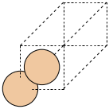
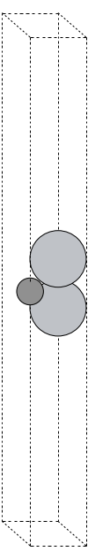
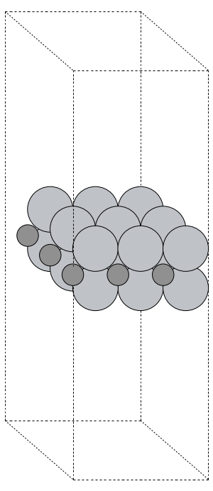
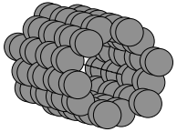
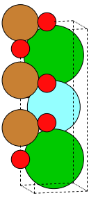

---
jupytext:
  text_representation:
    extension: .md
    format_name: myst
kernelspec:
  display_name: Python 3
  language: python
  name: python3
---

# Materials Science Python Packages

There are several packages that may be useful in studying materials science. We'll briefly introduce a few of them:
1. The Atomic Simulation Environment (ASE)
2. Python Materials Genomics (PyMatGen)
3. The Materials Project API (MPRester)

## ASE - The Atomic Simulation Environment


The [Atomic Simulation Environment (ASE)](https://wiki.fysik.dtu.dk/ase/) is an open-source set of tools and Python modules for setting up, manipulating, running, visualizing and analyzing atomistic simulations. ASE can help you molecules and crystals, and then simulate them at different levels of theory (density functional theory, molecular dynamics, etc.). ASE can interface with a variety of simulation software platforms including [VASP](https://www.vasp.at), [Quantum ESPRESSO](https://www.quantum-espresso.org), [Q-Chem](https://www.q-chem.com), [Gaussian](https://gaussian.com), and others (see the [full list](https://wiki.fysik.dtu.dk/ase/ase/calculators/calculators.html#supported-calculators)) through tools called calculators. ASE can create input files, launch simulations, and parse the output.

`ase` has a vast set of modules and functions, giving it vast and powerful functionality. We will only scratch the surface in this brief introduction to `ase`.

### Installation
To use ASE, you must first install the `ase` Python module. You may use a command such as `pip3 install ase` to do this.

### Usage

To simulate a material or molecule in ASE, the workflow is typically as follows:
1. Build an ASE `Atoms` object to represent your molecule or material
2. Use an ASE `calculator` object to perform a simulation and parse/visualize the results.

:::{Note}

Performing atomistic simulations are beyond the scope of this discussion. We will show you how to create an `Atoms` object. More information about performing simulations using `Atoms` objects and `calculator` objects may be found on the ASE documentation page [Atoms and Calculators](https://wiki.fysik.dtu.dk/ase/gettingstarted/tut01_molecule/molecule.html).
:::

### `ase.Atoms` Objects
In `ase`, we use an `Atoms` object for an atomistic description of a material system. An `Atoms` object is actually a collection of `Atom` objects, each of which describes an atom, with member data such as `symbol` (string), `position` (a 3-element tuple of Cartesian coordinates, in Angstroms). Other atomic properties could be specified, such as `mass`, `charge`, etc.

### Building Simple Molecules

Python code that uses `ase` must include an `import` statement that imports the `ase` tools (functions or classes) you want to use. Here, we will:
* use the `ase.build.molecule()` function to construct a water molecule, and
* make a representation of the molecule using the `ase.visualize.view()`

```{code-cell}

from ase.build import molecule
from ase.visualize import view

"""
   Build an ase.Atoms object to represent a water molecule.
   We use the molecule() function to do this, and we specify
   the chemical formula for water.
"""
water = molecule('H2O')

# The view() function provides an interactive, 3D visualization
view(water, viewer='x3d')
```

The `molecule()` function is provided as a simple way to build an `Atoms` object. Here, a molecule is specified using a Python string containing a chemical formula, and only a very limited set of molecules are supported. The list of available molecules is found in the `ase.collections.g2.names` list:
```{code-cell}

from ase.collections import g2

# print the ase.collections.g2.names list
print(g2.names)
```

Let's do this again for a formic acid molecule. Additionally, we will also  print the x, y, and z coordinates of each atom.


```{code-cell}

# construct a formic acid molecule
atoms = molecule('HCOOH')

"""
   Let's also print the symbol and coordinates of each atom.
"""
print('Show atomic coordinates:\n')
for X in atoms:
    x, y, z = X.position
    print('{0}\n  x: {1} Ang.\n  y: {2} Ang.\n  z: {3} Ang.'.format(X.symbol,
                                                                    x, y, z)
                                                                    )
```

We can still make an interactive, 3D visualization:

```{code-cell}

"""
   The view() function should occur last for an interactive result.
"""
# 3D visualization
view(atoms, viewer='x3d')

```

Having constructed an `ase.Atoms` object to represent water molecule, we could create a `calculator` object to run a simulation.

### Building Complex molecules

If you want to go beyond the simple molecules ASE can create using the `moleucles()` function, you may use other strategies:
* Construct a molecule from a structure file (`*.cif`, `*.xyz`, etc.)
* Read the structure from simulation output
* Obtain a structure from a molecular database

To read a structure from a file, use the `read()` function from the `ase.io` module. This module allows ASE to read from and write to files containing information about materials ([documentation](https://wiki.fysik.dtu.dk/ase/ase/io/io.html)).

### Building Simple Crystals - Bulk Silicon

We will start with a simple (bulk) silicon crystal using the `bulk()` function in the `ase.build` module.

```{code-cell}

from ase.build import bulk
from ase.io import write   # helps us save an image

atoms = bulk('Si')

"""
   This is a easy way to make a simple (static) visualization.
"""
write('silicon_basis.png', atoms, show_unit_cell=2)

```

The static image of the silicon crystal (the two-atom basis for the FCC crystal) is given below.



We can also make an interactive 3D image:

```{code-cell}

view(atoms, viewer='x3d')

```

### Building a 2D System - a MXene

The `ase.build` module provides functions for building 2D structures. For example:
* `graphene_nanoribbon()` may be used to make graphene nanoribbons and graphene sheets.
* `mx2()` may be used to build MXene and [transition metal dichalcogenide](https://www.sciencedirect.com/topics/materials-science/transition-metal-dichalcogenides#:~:text=TMD%20monolayers%20are%20structurally%20of,octahedral%20or%20trigonal%20prismatic%20coordination.) (TMD) monolayers.

Here, we will make a MXene.

```{code-cell}

from ase.build import mx2
from ase.io import write
from ase.visualize import view # 3D interactive image

# This forms a primitive unit cell
Ti2C = mx2('CTi2', vacuum = 15) # unit cell

"""
   We can also build a sheet. We form a supercell by repeating the unit cell
   3x in the x and y directions, and only one time in the z direction.
"""

# Static image of the unit cell
rotation = '0z,-60x'
write('Ti2C_unit_cell.png', Ti2C, show_unit_cell=2, rotation=rotation)

```

As static image of the unit cell is given below. Since a structure like this would likely be used in a DFT calculation, and DFT calculations often have periodic boundary conditions, the unit cell features a large air gap to keep separate the main sheet from its images in the z direction.



Now, we form a supercell by repeating the unit cell in space. To repeat the primtive cell, described by the `Ti2C` object, we simply multiply `Ti2C` by a 3-element tuple. The three integers `(nx, ny, nz)` repeat the unit cell in the x, y, and z directions, respectively.
```{code-cell}

sheet = Ti2C*(3,3,1) #

# Static image of the sheet
write('Ti2C_sheet.png', sheet, show_unit_cell=2, rotation=rotation)

# I've suppressed the interactive 3D view
# view(Ti2C, viewer='x3d', repeat=(4,4,1))

```

Additionally, the static image of the sheet is given below:



### Building a 1D System - a Carbon Nanotube

A next example will be a carbon nanotube. ASE has functionality to build such structures in the `nanotube()` function.

```{code-cell}

from ase.build import nanotube
from ase.io import write # helps us save an image
from ase.visualize import view # 3D interactive image

atoms = nanotube(6, 0, length=4)

"""
   This is a easy way to make a simple (static) visualization.
"""
orientation='12y,-15z'
write('nanotube.png', atoms, show_unit_cell=2, rotation=orientation)
```

The static image of the nanotube is given below.



An interactive 3D image of the carbon nanotube is shown below.

```{code-cell}

# Interactive 3D visualization
view(atoms, viewer='x3d')

```


### Building Complex Crystals

The structures the `ase.build` module allows you to construct are fairly basic. For more advanced structures, we may follow the same strategies as for the complex molecules:
* Construct a crystal structure from a structure file (`*.cif`, `*.xyz`, etc.)
* Read the structure from simulation output
* Obtain a structure from a materials database

To read a structure from a file, use the `read()` function from the `ase.io` module. This module allows ASE to read from and write to files containing information about materials ([documentation](https://wiki.fysik.dtu.dk/ase/ase/io/io.html)).


## Pymatgen - Python Materials Genomics


[Pymatgen](https://pymatgen.org) is a Python package similar to `ase`. `pymatgen` is designed to support VASP and ABINIT. Like `ase`, we will not be able to cover much of the extensive functionality of `pymatgen`.

:::{Note}

Our use of `pymatgen` will be very limited. Nonetheless, we will install `pymatgen` for use as a converter:  we can obtain crystal structure data from the Materials Project and convert it to an `ase` `Atoms` object.
:::

### Installation

If you need to, please install `pymatgen`, please do so using a command such as `pip3 install pymatgen`.


## MPRester - The Materials Project API


[The Materials Project API](https://materialsproject.org/api) allows a user to query information from [the Materials Project](https://materialsproject.org).

:::{admonition} What is an API?
:class: note, dropdown

"API" stands for *application programming interface*. An API is a set of commands defined to allow programmatic access to a server that archives or generates data for users.

APIs are especially useful for automating queries. They make getting large amounts of information much more efficient than point-and-click manual access to a web server via an Internet browser.
:::

### Installation

The Materials Project API is coded in the Python package `MPRester`. To use ASE, you must first install the `ase` Python module. You may use a command such as `pip3 install mp-api` to do this.

::::{important}
:::{note}
An API key is required to use `MPRester`.
* You must be logged in on [materialsproject.org](https://materialsproject.org) to obtain your API key.
* You can obtain your personal API key from your Materials Project [Dashboard](https://next-gen.materialsproject.org/dashboard), or you can get it from the [documentation page](https://materialsproject.org/api#documentation).
* Your API key is a long alphanumeric string (about 30 characters) that you must use every time you wish to query the Materials Project programmatically via the API.
:::
::::

### Using `MPRester`

To use your API key, it is helpful to store its value in a string, like this:
```{code-cell}
# Save your Materials Project API as a string
MP_API_KEY = '---your api key here ----'
```

```{code-cell}
:tags: ["remove-cell"]

import os

MP_API_KEY = os.environ['MP_API_KEY']
```

Once the API key is stored as a string in a variable (here, we used the variable `MP_API_KEY`), that variable is used as a parameter with `MPRester` to obtain information from the Materials Project. The syntax is to define a code block using code like `with MPRester(MP_API_KEY) as mpr:`. Following this line, indented lines define a code block in which we can access the API methods using the syntax `mpr.some_method()`. Let's start with some examples of `MPRester` usage.

#### Example: Get the Crystal Structure of a Specific Material

In the Materials Project, each material has a unique identifier, known as its Materials Project ID (MPID). When you want information about a single material, it is reasonable to perform a [manual search](https://materialsproject.org/materials) for the material so you can find its MPID. Then, you can use the MPID along with `MPRester` to automate queries about the material.

As an example, YBa2Cu3O7 has `mp-20674` as its MPID. We can obtain its crystal structure directly using this MPID. To do this, we do the following:

```{code-cell}
:tags: ["hide-output"]

from mp_api.client import MPRester
import os
import pymatgen as pmg

from ase.io import write

MPID = 'mp-20674' # Materials Project ID number

"""
  The 'with ...' statement defines an MPRester code block. Subsequent
  indented statements belong to the code block, and the object mpr
  may be used within the code block.
"""
with MPRester(MP_API_KEY) as mpr:
    # Get only the structure for YBa2Cu3O7
    structure = mpr.get_structure_by_material_id(MPID)

```

The `MPRester` method, `get_structure_by_material_id()`, accessable as `mpr.get_structure_by_material()`, queries the Materials Project and returns the crystal structure, storing it in an object `structure`. Having accessed the Materials Project, we no longer require the `mpr` object. We can now exit the `MPRester` code block by resetting the indentation.

Next, we provide code to inspect the structure we downloaded. What is its data type? How can we use it?

```{code-cell}

"""
  Reset the indentation (exith the 'with' block), and examine the
  structure we obtained.
"""
print('\nWhat is the data type of the structure we obtained?')
print(type(structure))

print('\nWhat is the structure we obtained?')
print(structure)

```

The output of the above code cell indicates that the data in `structure` is in a format compatible with `pymatgen`. `pymatgen` has a tool to convert the `pymatgen` structure to an `ase` object, which we can visualize.

```{code-cell}

from pymatgen.io.ase import AseAtomsAdaptor as aaa

"""
   We use pymatgen to convert the structure to an
   ASE object. Since our work with the MaterialsProject
   API is complete, this can be done outside the WITH
   block.
"""
crystal = aaa.get_atoms(structure) # convert pymatgen to ase

# Make a static visualization
orientation='90x,75y,-9x'
write('YBa2Cu3O7_structure.png', crystal, show_unit_cell=2,
      rotation=orientation)

```



The following code creates an interactive visualization for the downloaded crystal structure.

```{code-cell}

# Interactive 3D visualization
view(crystal, viewer='x3d')

```

Having obtained the crystal structure, we can now use it in a variety of ways:
* Use it within an atomistic simulation
* Use `ase.io.write()` to save the structure in a structure file (`*.cif`, `*.xyz`, etc.)


#### Example: Searching using `MPRester`

Materials Project data can be queried in two ways:
* through a specific (list of) MPID(s), and/or
* through property filters (e.g. band gap less than 0.5 eV)

When querying a list of MPIDs, we use the following syntax:
```{code-cell}
:tags: ["hide-output"]

with MPRester(MP_API_KEY) as mpr:
    docs = mpr.summary.search(material_ids=["mp-149", "mp-13", "mp-22526"])

```

Here, each material entry in the Materials Project has summary data, and we are simply searching the summary data using `mpr.summary.search()`. Since we queried for a list of MPIDs, we store in `docs` a list of "documents" (formally, a list of `MPDataDoc` objects).

We can now reference an individual document and extract its properties. We'll use a `for` loop to list the MPID and chemical formula for each search hit:

```{code-cell}

print('Our query returned {0} docs.'.format( len(docs) ))

for idx, mat_doc in enumerate(docs):
    print('Item {0}: MPID = {1} (formula: {2})'.format(idx,
                                                       mat_doc.material_id,
                                                       mat_doc.formula_pretty))

```

What properties (`'material_id'`, `'formula_pretty'`, etc.) are available for search in the summary data? We can obtain a list of document properties using the following syntax:
```{code-cell}

print(mpr.summary.available_fields)
```

Next, we query using property filters. We apply the following filters:
* Materials containing Si and O
* Materials with a band gap no greater than 1.0 eV but no less than 0.5 eV
* Instead of all available summary fields, we'll only ask for a few: `"material_id"`, `"formula_pretty"`, `"band_gap"`.
```{code-cell}
:tags: ["hide-output"]

with MPRester(MP_API_KEY) as mpr:
    docs = mpr.summary.search(elements=["Si", "O"],
                                band_gap=(0.5, 1.0),
                                fields=["material_id", "formula_pretty",
                                        "band_gap"])

example_doc = docs[0]
# initial_structures = example_doc.initial_structures

```

To see what our search turned up, we can use some simple code, like this. We first find out how many hits our query returned using `len(docs)`, and then we print only the first `N` hits, where we set `N = 10`.

```{code-cell}

N = 10
print('Our query returned {0} docs.'.format( len(docs) ))
print(f'Printing only the first {N} results:')

for idx in range(0,N):
    mat_doc = docs[idx]
    print('Item {0}: MPID = {1} ({2}), band gap = {3:6.4f} eV'.format(idx,
                                             mat_doc.material_id,
                                             mat_doc.formula_pretty,
                                             mat_doc.band_gap))

```
