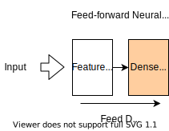
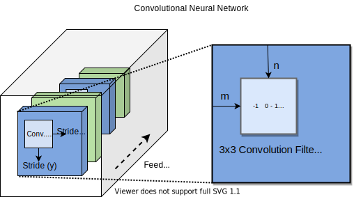
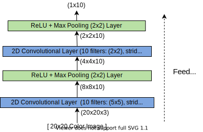

---
jupytext:
  text_representation:
    extension: .md
    format_name: myst
kernelspec:
  display_name: Python 3
  language: python
  name: python3
---

# Neural Network Architectures

In neural networks, the layers of neurons can be arranged in many different ways in order to serve a particular purpose or to solve a particular kind of supervised (or even unsupervised) learning problem. These canonical designs for neural networks are called _neural network architectures_. In this section, we will briefly explore various neural network architectures. In the previous section, we build an example of a standard feed-forward neural network with two layers: a hidden layer (also called the _feature layer_ because it extracts features from the data) followed by a densely connected layer that aggregates these features and produces an output. We can summarize this network architecture as follows:



In this section, we will explore some additional neural network architectures that are useful for solving specific problems, such as making predictions from images, sequences of data, or for detecting anomalies.

## Convolutional Neural Networks

Convolutional neural networks (CNNs) are the most popular neural network architecture in the area of _computer vision_, which deals with models that extract features and generate predictions from images. In materials science, CNNs have been applied successfully in the area of analyzing images of macroscopic surface defects, analyzing atomic force microscope images, and classifying molecular orbitals. CNNs can work with 1D images (i.e. sequences of fixed length), 2D images, and even 3D images.

Recall that an image can be represented as matrix $\mathbf{X}$ of grayscale values from $0$ to $1$, or even a matrix of RGB (red/blue/green) vectors for each pixel. In order to extract features from an image, a CNN learns a series of [convolution matrices](https://en.wikipedia.org/wiki/Kernel_(image_processing)) $\mathbf{K}$, which are passed over the image in order to extract features from it. These convolution filters are used by the network to extract edges, shapes and other features from an image.



Applying a convolution filter to an image involves treating the filter as a "sliding window" over the image, where the entries of the filter are multiplied by the corresponding values in the image and added together. After the convolution filter, a non-linear activation $\sigma(x)$ is often applied to the resulting scalar value. The convolution matrix is moved and then applied along each row and column of the image with fixed step size. This step size is called the _stride_. Here, we will denote the row and column stride as $s_r$ and $s_c$ respectively. The results of each application of the convolution filter $|mathbf{k}$ can then be combined into a smaller "image of features" $\mathbf{A}$, the entries of which are given by:

$$\mathbf{A}_{n,m} = \sigma\left(\sum_{i,j} \mathbf{K}_{i,j} \cdot \mathbf{X}_{(i+s_yn), (j+s_xm)}\right)$$

Typically, $\mathbf{A}$ has a slightly smaller size than the input image $\mathbf{X}$, since the stride is often set to be greater than $1$. Since the purpose of a convolutional neural network is to extract features, the image must be eventually reduced in size to a single vector of features. To further reduce the size of the image, it is customary to apply _Max Pooling_ to each "feature image" $|mathbf{A}$. This is done by building a smaller "feature image" $\mathbf{B}$ from $\mathbf{A}$ where each element in $\mathbf{B}$ is the maximum value in a small square region of elements in $\mathbf{A}$. Specifically, if $m\times n$ max pooling is applied to $\mathbf{A}$, the resulting entries of $\mathbf{B}$ are computed as:

$$\mathbf{B} = \text{Maxpool}_{(k\times k)}(\mathbf{A})\quad \Rightarrow\quad  \mathbf{B}_{n,m} = \max\limits_{\substack{(n-1)k~<~i~\le~nk \\  (m-1)k~<~j~\le~mk}} \left( \mathbf{A}_{ij} \right)$$

When building a CNN, one typically uses alternating layers of convolution (followed by an activation function) and max pooling. Below, we give one detailed example of the layers of a small CNN used to deistinguish between images of 10 classes:



We can implement this model using Pytorch as follows:

```{code-cell}
import torch
import torch.nn as nn

class Conv2DNet(nn.Module):
    def __init__(self, num_classes):
        super(Conv2DNet, self).__init__()
        self.conv1 = nn.Conv2d(in_channels=3, out_channels=10, kernel_size=5, stride=2, padding=2)
        self.relu = nn.ReLU()
        self.maxpool = nn.MaxPool2d(kernel_size=2)
        self.conv2 = nn.Conv2d(in_channels=10, out_channels=10, kernel_size=2, stride=2, padding=1)
        self.maxpool = nn.MaxPool2d(kernel_size=2)
        self.output = nn.Linear(10, num_classes)
    
    def forward(self, x):
        out = self.conv1(x)
        out = self.relu(out)
        out = self.maxpool(out)
        out = self.conv2(out)
        out = self.relu(out)
        out = self.maxpool(out)
        out = out.view(out.size(0), -1)  # Flatten the tensor to a 1D array
        out = self.output(out)
        return out
```

Below, we create an instance of this model an verify the output shape is correct:

```{code-cell}
:tags: [hide-input]
# Example usage
input_channels = 3 # the number of channels is usually 3 in an R-G-B color image
input_height = 20  # the height of the input image (in pixels)
input_width = 20   # the width of the input imahe (in pixels)
num_classes = 10   # number of classes to predict from
batch_size = 32    # batch size of the model

# Create a random input tensor
input_tensor = torch.randn(batch_size, input_channels, input_height, input_width)

# Create an instance of the 2D convolutional neural network
model = Conv2DNet(num_classes)

# Forward pass
output_tensor = model(input_tensor)

# Print the output tensor shape
print('Output shape:', output_tensor.shape)
```

## Recurrent Neural Networks

[_Recurrent neural networks_ (RNNs)](https://en.wikipedia.org/wiki/Recurrent_neural_network) are a type of neural network architecture used for learning from sequences of data. These sequences may even be of a varying length. An RNN  has a special sequence of layers called the _recurrent unit_, which passes a hidden state vector from one element in the sequence to the next. RNNs usually output a vector of features corresponding the entire sequence, though they can also be used for tasks such as sequence-to-sequence mapping. RNNs are a popular choice for problems such as forecasting time-series data or translating and analyzing text. An RNN typically consists of three parts: layers for extracing featuers from data, the recurrent unit, and a sequence of dense layers used for computing an output. We can visualize an RNN architecture in one of two equivalent ways: the "folded" view and the "unfolded" view, as shown below:


There are a few different types of recurrent units using in RNNs, though the most popular are [_long short-term memory_ (LSTM)](https://en.wikipedia.org/wiki/Long_short-term_memory) units and [_gated recurrent units_ (GRUs)](https://en.wikipedia.org/wiki/Gated_recurrent_unit). The LSTM recurrent unit contains many weights that are used to propagate features from one cell to the next. Specifically, it has both a _hidden state vector_ $\mathbf{h}$ and a _cell state vector_ $\mathbf{c}$ that is passed between cells in the "unfolded" view of the network:


However, we note that it is more technically correct to say that the information is passed back into the recurrent unit itself, along with the features extracted from the next element in the sequence. This idea is captured in the equivalent "folded" view of the RNN. We will not dicuss the details of how RNNs, and specifically their recurrent units function, as they are quite complicated. Fortunately, this complexity is abstracted away in Pytorch's [`torch.nn.RNN`](https://pytorch.org/docs/stable/generated/torch.nn.RNN.html) layer, which we can use to construct a basic recurrent neural network:

```{code-cell}
class RNN(nn.Module):
    def __init__(self, input_size, hidden_size, num_layers, output_size):
        super(RNN, self).__init__()
        self.hidden_size = hidden_size
        self.num_layers = num_layers
        self.rnn = nn.RNN(input_size, hidden_size, num_layers, batch_first=True)
        self.fc = nn.Linear(hidden_size, output_size)
    
    def forward(self, x):
        h0 = torch.zeros(self.num_layers, x.size(0), self.hidden_size).to(x.device)
        out, _ = self.rnn(x, h0)
        out = out[:, -1, :]
        out = self.fc(out)
        return out
```

Below, we give a basic example of how this model can be invoked:

```{code-cell}
:tags: [hide-cell]
# Example usage
input_size = 10
hidden_size = 32
num_layers = 2
output_size = 5
sequence_length = 20
batch_size = 8

# Create a random input tensor
input_tensor = torch.randn(batch_size, sequence_length, input_size)

# Create an instance of the recurrent neural network
model = RNN(input_size, hidden_size, num_layers, output_size)

# Forward pass
output_tensor = model(input_tensor)

# Print the output tensor shape
print('Output shape:', output_tensor.shape)
```

## Autoencoders

```{code-cell}
class Autoencoder(nn.Module):
    def __init__(self, input_size, reduced_size, encoding_size):
        super(Autoencoder, self).__init__()

        self.relu = nn.ReLU() 
        self.encoder_1 = nn.Linear(input_size, reduced_size)
        self.encoder_2 = nn.Linear(reduced_size, encoding_size)
        self.decoder_1 = nn.Linear(encoding_size, reduced_size)
        self.decoder_2 = nn.Linear(reduced_size, input_size)
    
    def forward(self, x):
        x_reduced = self.relu(self.encoder_1(x))
        encoded = self.self.encoder_2(x_reduced)
        x_expanded = self.relu(self.decoder_1(encoded))
        decoded = self.decoder_2(x_expanded)
        return decoded
```

```{code-cell}
:tags: [hide-cell]
# Example usage
input_size = 10
reduced_size = 8
encoding_size = 5
batch_size = 32

# Create a random input tensor
input_tensor = torch.randn(batch_size, input_size)

# Create an instance of the autoencoder neural network
model = Autoencoder(input_size, reduced_size, encoding_size)

# Forward pass
output_tensor = model(input_tensor)

# Print the output tensor shape
print(output_tensor.shape)
```
