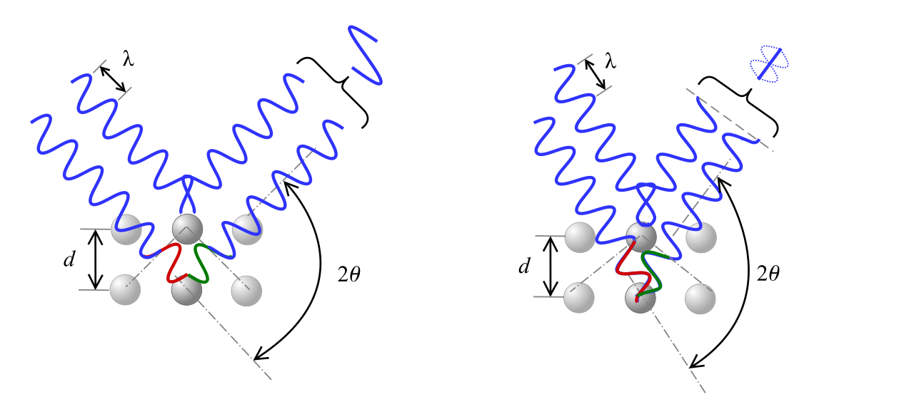
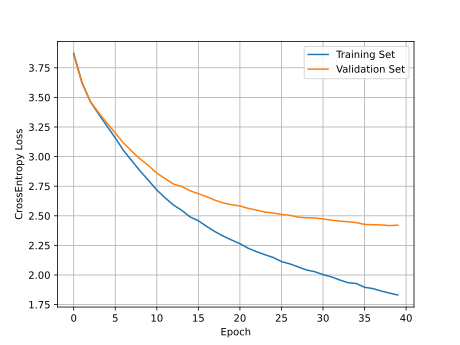
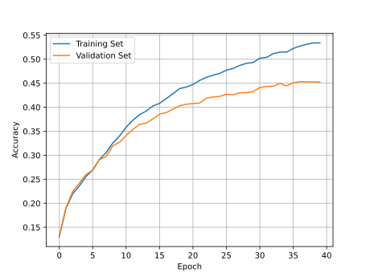

---
jupytext:
  text_representation: 
    extension: .md
    format_name: myst
kernelspec:
  display_name: Python 3
  language: python
  name: python3
---

# Application: XRD Crystal Structure Prediction

Now that we know how to create and train neural networks in PyTorch, let's get some practice applying them to solve an important problem in solid state crystallography: predicting crystal symmetries (in particular, the crystal space group) from powder x-ray diffraction patterns.

## X-Ray Diffraction (XRD)

X-ray crystallography is a powerful technique for characterizing the arrangement of atoms in solid structure, first introduced by Paul Ewald and Max von Laue in 1912. It has since been applied to estimate the lattice constants of crystalline solids, and even to obtain the structure of complex organic molecules, such as proteins.

In X-ray crystallography, an X-ray beam is focused into a crystalline material, causing the beam to diffract from the periodically arranged nuclei at specific angles $\theta$. These diffraction angles $\theta$ are given by Bragg's diffraction law

$$n \lambda = 2 d\sin(\theta)$$

where $\lambda$ is the wavelength of the incident beam, $n$ is a small integer (the diffraction order), and $d$ is the distance between two planes of atoms in the material.



For each material, there are many different values of $n$ and $d$ that satisfy Bragg's law, forming diffraction "peaks" at several different angles $\theta$. The angle and intensity of these peaks depend on the symmetries and lattice constants of a material; however reverse-engineering the full 3D structure of a crystal from these peaks is known to be an exceptionally difficult problem.

In this application, we will attempt to use simple neural networks to predict the space group of known materials from their XRD spectrum. The space group of a material describes all of the symmetries of the material's crystal lattice. For three dimensional materials, there are up to 230 unique space groups our neural network will need to identify based on XRD data alone.

You can download the dataset for this section using the following Python code:

```
import requests

CSV_URL = 'https://raw.githubusercontent.com/cburdine/materials-ml-workshop/main/MaterialsML/neural_networks/xrd_dataset_full.csv'

r = requests.get(CSV_URL)
with open('xrd_dataset_full.csv', 'w', encoding='utf-8') as f:
    f.write(r.text)
```

Alternatively, you can download the CSV file directly [here](https://raw.githubusercontent.com/cburdine/materials-ml-workshop/main/MaterialsML/neural_networks/xrd_dataset_full.csv).

## Loading the Dataset

We will begin by loading the X-ray diffraction dataset into a Pandas dataframe object. Since this dataset has already been cleaned, we will not need to do any additional processing of the dataframe entries. To get an understanding of the data features, we can view the dataframe using the `display()` function:

```{code-cell}
:tags: [hide-input]
import pandas as pd

# load dataset into a pandas DataFrame:
XRD_CSV = 'xrd_dataset_full.csv'
data_df = pd.read_csv(XRD_CSV)

# show dataframe in notebook:
display(data_df)
```
Here is a summary of the features included in the dataset:

* _mp_id_: Materials Project ID of material
* _formula_: Chemical formula
* _composition_: Composition of the material's conventional unit cell
* _crystal\_system_: The crystal system of the material's conventional unit cell
* _symmetry_symbol_: The [space group symmetry symbol](https://en.wikipedia.org/wiki/Space_group) of the material's conventional unit cell
* _cell\params_: The parameters of the conventional unit cell of the form $(a,b,c,\alpha, \gamma, \beta)$, where
    * $a,b,c$ are the lattice constants of the unit cell.
    * $\alpha, \beta, \gamma$ are angles between the lattice vectors, in degrees.
* _energy\_above\_hull_: The estimated energy above the convex hull of stable materials, in eV/atom. The higher this number, the more unstable the material is.
* _xray\_peaks_: A list of ideal X-ray diffraction peak angles (units of $$2\theta$, where $2\theta$ is in degrees). The peaks are sampled between $0^{\circ} < 2\theta < 90^{\circ}$. Here, we assume that a standard Copper K-alpha radiation source is used ($\lambda \approx 1.54$ Å).
* _xray\_intensities_: A list of intensities of each X-ray diffraction peak, on a scale of 0.0 to 100.0 (arbitrary units).


## Preprocessing Data 

As we have done in our previous applications, let's determine the set of unique elements, crystal systems, and symmetry symbols represented in our dataset, which will be helpful for converting our data to a vectorized for. We will save these unique values to the variables `ELEMENTS`, `CRYSTAL_SYSTEMS` and `SYMM_SYMBOLS` respectively.

```{code-cell}
import ast # parses Python literals from text

# Generate a list of elements in the dataset:
ELEMENTS = set()
for v in data_df['composition'].values:
    ELEMENTS |= set(ast.literal_eval(v).keys())
ELEMENTS = sorted(ELEMENTS)

# Generate a list of the crystal systems in the dataset:
CRYSTAL_SYSTEMS = sorted(set(data_df['crystal_system']))

# Generate a list of the symmetry symbols:
SYMM_SYMBOLS = sorted(set(data_df['symmetry_symbol']))

# print the sizes of ELEMENTS and CRYSTAL_SYSTEMS
print('Number of elements:', len(ELEMENTS))
print('Number of symmetry symbols:', len(SYMM_SYMBOLS))
print('Number of crystal systems:', len(CRYSTAL_SYSTEMS))
```

In total, there are 88 elements represented in the dataset, with 7 different crystal systems. For all distinct crystal systems, the configuration of the atoms in the conventional unit cell can be arranged such that their 3D symmetries are characterized by [one of the 230 space groups in three dimensions](https://en.wikipedia.org/wiki/List_of_space_groups#list). In our dataset, we have 228 of these 230 distinct space groups represented. Each of the space groups in our dataset is uniquely represented by a symbol in [Hermann-Mauguinn Notation](https://en.wikipedia.org/wiki/Hermann%E2%80%93Mauguin_notation):

```{code-cell}
:tags: [hide-output]
print(SYMM_SYMBOLS)
```

The space groups of materials can be partitioned into mutually exclusive groups based on their corresponding crystal system. We can build the mapping of symmetry symbols to their associated crystal system by populating a Python dictionary:

```{code-cell}
# Generate a map from each symmetry symbol to
# the corresponding crystal system
SYMM_SYMBOL_MAP = {}
for _, row in data_df.iterrows():
    system = row['crystal_system']
    symm = row['symmetry_symbol']
    SYMM_SYMBOL_MAP[symm] = system
```

## Visualizing the XRD Spectrum

To gain a better understanding of what an X-ray diffraction spectrum looks like, we will need to first write some Python functions to parse the XRD peaks and intensities from each row of our dataframe. Then, we will need to write a function that plots the XRD spectrum. We give you the Python code for these two functions below.

```{code-cell}
import matplotlib.pyplot as plt

def parse_xrd_data(row):
    peaks = ast.literal_eval(row['xray_peaks'])
    ints = ast.literal_eval(row['xray_intensities'])
    return peaks, ints
    
def plot_xrd(peaks, intensities):
    
    plt.figure()
    for x, y in zip(peaks, intensities):
        plt.plot([x,x], [0, y], color='b', linewidth=2)
    
    plt.axhline(color='b')
    plt.xlim((0,90))
    plt.grid()
    plt.ylabel('Intensity [arb. units]')
    plt.xlabel(r'Diffraction Angle $2\theta$ [degrees]')
    plt.show()
```

Let's now visualize the X-ray diffraction spectrum for an example material in our dataset:
```{code-cell}
example_idx = 1234

peaks, intensities = parse_xrd_data(data_df.iloc[example_idx])
plot_xrd(peaks, intensities)
```
In our dataset, the diffraction patterns correspond to large crystals, which is why we observe very sharp peaks in the spectrum. In practice, however, such sharp peaks are rarely observed due to the finite sizes of the crystals used in experimental settings. (This finite-size effect is known as [Scherrer broadening](https://en.wikipedia.org/wiki/Scherrer_equation).

To convert each XRD spectrum to a feature vector that can serve as input to a neural network, we will use a histogram-based representation of the X-ray diffraction data. Specifically, we will divide the spectrum into a finite number of "bins" and normalize each "bin" by dividing by the maximum peak intensity (which is 100 for this dataset). We will also write a function to convert the symmetry group symbols to a vector representation using the same "one-hot" encoding that we have used in previous applications.

```{code-cell}
import numpy as np

def vectorize_xrd_spectrum(peaks, intensities, intensity_scale=100, bins=90):
    hist, _ = np.histogram(
        peaks, bins=bins,
        range=(0, 90),
        weights=intensities)
    
    return hist / intensity_scale
    
def vectorize_symmetry(symmetry_symbol, symbols):
    """ converts a symmetry symbol to a vector. """
    vec = np.zeros(len(symbols))
    if symmetry_symbol in symbols:
        vec[symbols.index(symmetry_symbol)] = 1.0

    return vec
```

Next, we will write a function to parse each row of the dataframe return an $\mathbf{x}$ vector (the histogram of the XRD spectrum) and a $\mathbf{y}$ vector (the space group of the material).

```{code-cell}
def parse_data_vector(row):
    """ parses x and y vectors from a dataframe row """
    
    # parse the xray peaks and intensities
    peaks, ints = parse_xrd_data(row)
    
    # parse feature vector (x):
    x_vector = vectorize_xrd_spectrum(peaks, ints)
    
    # parse label vector (y):
    y_vector = vectorize_symmetry(
        row['symmetry_symbol'], symbols=SYMM_SYMBOLS)
    
    return x_vector, y_vector
```

## Compiling the Dataset

Now that we have functions that can parse each row in our dataframe, let's write a dataset class called `XRDDataset` that extends the PyTorch Dataset class ([`torch.utils.data.Dataset`](https://docs.pytorch.org/docs/stable/data.html#torch.utils.data.Dataset)). Since the dataset may take a long time to compile we will add a progress bar using the `tqdm` package, so that we can see how long the dataset will take to compile.

```{code-cell}
from torch.utils.data import Dataset
from tqdm import tqdm

# Define a custom dataset class
class XRDDataset(Dataset):
    def __init__(self, xrd_df):

        data_x = []
        data_y = []

        # parse data from datafrane
        for _, row in tqdm(xrd_df.iterrows(), total=len(xrd_df)):
            x, y = parse_data_vector(row)
            data_x.append(x)
            data_y.append(y)

        np_data_x = np.array(data_x)
        np_data_y = np.array(data_y)

        # convert data to pytorch tensors
        self.data_x = torch.tensor(np_data_x, dtype=torch.float32)
        self.data_y = torch.tensor(np_data_y, dtype=torch.float32)
        
    def __len__(self):
        """ returns the size of this dataset"""
        return len(self.data_x)
    
    def __getitem__(self, idx):
        """ Gets the (x,y) pair at index 'idx' """
        x = self.data_x[idx]
        y = self.data_y[idx]
        return x, y
```

Next, we will create an `XRDDataset` instance and split it into training, validation, and test sets.

```{code-cell}
:tags: [remove-output]

from torch.utils.data import random_split

# compile dataset
dataset = XRDDataset(data_df)

# split dataset into training, validation, and test sets
train_dataset, val_dataset, test_dataset = \
    random_split(dataset, [0.8, 0.1, 0.1])
```

## XRDNet Model

After compiling the dataset, our next step is to define our model. Here, we will use a simple feed-forward neural network but with a configurable number of layers with user-specified sizes. This will allow us to explore different model architectures and determine which architecture yields the best results.

To define our model, we will extend the [`torch.nn.Module`](https://docs.pytorch.org/docs/stable/generated/torch.nn.Module.html) class, creating our own class called `XRDNet`. This class will have a constructor that takes the following arguments:

* `input_size`: The size of the model's input vectors (the number of XRD spectrum "bins").
* `hidden_layer_sizes`: A list of sizes corresponding to the size of the hidden feature vectors for each hidden layer.
* `output_size`: The size of the model's output vector (the number of space groups).

Extending the `nn.Module` class requires us to define the `forward()` function, which is called when an instance of the model class is called as if it were a Python function. For the `forward()` function, we will output a vector of numbers corresponding to the log-likelihoods that the XRD spectrum is associated with the corresponding space group. We will also add a function called `classify()` that returns a vector where the most likely space group is assigned a value close to $1$, and all other space groups are assigned values close to $0$. (This is achieved using the `nn.SoftMax()` activation function, which maintains differentiability of the model weights with respect to the output of `classify()`).

```{code-cell}
import torch
import torch.nn as nn

# Define the neural network class (XRDNet)
class XRDNet(nn.Module):

    def __init__(self, input_size, hidden_layer_sizes, output_size):
        """ Constructs a feed-forward neural network with many hidden layers"""
        super().__init__()

        layer_sizes = [input_size]
        layer_sizes.extend(hidden_layer_sizes)
        layer_sizes.append(output_size)
        
        self.hidden_layers = nn.ParameterList([
            nn.Linear(size_in, size_out)
            for size_in, size_out in 
            zip(layer_sizes[:-1], layer_sizes[1:])
        ])

        # define hidden layer activation function:
        self.activation = nn.SiLU()

        # use the softmax activation (only when classifying)
        self.out_activation = nn.Softmax(dim=-1)

    def forward(self, x):
        """ Estimates the log-likelihood of each output feature"""
        for layer in self.hidden_layers[:-1]:
            x = self.activation(layer(x))
        
        out = self.hidden_layers[-1](x)

        return out
    
    def classify(self, x):
        """ Estimates the normalized output probability of each output feature"""
        
        out = self.output_logits(x)
        return self.out_activation(out)
```

It will also be helpful to create some functions that evaluate the model's loss function and overall model accuracy for an entire dataset:

```{code-cell}
def eval_model_loss(model, data_loader, loss_fn):
    
    loss = []
    with torch.no_grad():
        for z_batch, y_batch in data_loader:
            loss.append(loss_fn(model(z_batch), y_batch))

    mean_loss = torch.stack(loss).mean().item()

    return mean_loss

def eval_model_accuracy(model, data_loader):
    acc = []
    with torch.no_grad():
        for z_batch, y_batch in data_loader:
            pred_class = model.classify(z_batch).argmax(dim=-1)
            true_class = y_batch.argmax(dim=-1)
            acc.append((pred_class == true_class).to(torch.float32).mean())

    mean_acc = torch.stack(acc).mean().item()

    return mean_acc
```

Let's go ahead and create an instance of our `XRDNet` class:

```{code-cell}
model = XRDNet(
    input_size=len(dataset[0][0]),
    hidden_layer_sizes= [512, 512, 256, 128],
    output_size=len(dataset[0][1]),
)
```

## Fitting the Model

In order to fit our model to the training dataset, we will have to write some code to perform our main training loop. To simplify the fitting process, we will wite a function `fit_model()` with the following arguments:

* `model`: The classification model we are fitting.
* `train_dataset`: The training dataset we are fitting to.
* `val_dataset`: The validation dataset we will use to compare to the training loss during the fitting process.
* `n_epochs`: The number of epochs used during training. Recall that during each epoch, the batch gradient descent algorithm iterates over each item in the training dataset once.
* `batch_size`: The batch size used in the batch gradient descent algorithm. Recall that the batch size corresponds to how many items in the dataset are included in each weight update step. 
* `lr`: The learning rate $\eta$ used during batch gradient descent.
* `wd`: The weight decay regularization factor. (When weight decay is used, you should use the `AdamW` optimizer instead of the regular `Adam` optimizer).

```{code-cell}
from torch.utils.data import DataLoader
import torch.nn as nn
import torch.optim as optim
from tqdm import tqdm

def fit_model(model, train_dataset, val_dataset, n_epochs=100, batch_size=64, lr=1e-3, wd=1e-3):

    train_loader = DataLoader(train_dataset, batch_size=batch_size, shuffle=True)
    val_loader = DataLoader(val_dataset, batch_size=batch_size, shuffle=False)
    
    optimizer = optim.AdamW(model.parameters(), lr=lr, weight_decay=wd)
    loss_fn = nn.CrossEntropyLoss()
    
    # create a dict to record losses during training
    history = {
        'train_loss': [],
        'val_loss': [],
        'train_acc': [],
        'val_acc': []
    }

    # main training loop (fixed number of epochs)
    for epoch in range(n_epochs):
        
        # apply stochastic gradient descent step to each batch in dataset
        print(f'Epoch {epoch}')
        epoch_losses = []
        for z_batch, y_batch in tqdm(train_loader):
            
            # zero optimizer gradients
            optimizer.zero_grad()
    
            # generate batch prediction
            y_hat_batch = model(z_batch)
            
            # compute loss
            loss = loss_fn(y_hat_batch, y_batch)
            epoch_losses.append(loss.item())
    
            # backpropagate loss
            loss.backward()
            optimizer.step()

        # evaluate epoch training and validation losses:
        train_loss = eval_model_loss(model, train_loader, loss_fn)
        val_loss = eval_model_loss(model, val_loader, loss_fn)

        # evaluate epoch accuracies:
        train_acc = eval_model_accuracy(model, train_loader)
        val_acc = eval_model_accuracy(model, val_loader)
        
        print(f'Train loss: {train_loss}; Val loss: {val_loss}')
        print(f'Train acc: {train_acc}; Val acc: {val_acc}')

        # record losses in history dictionary
        history['train_loss'].append(train_loss)
        history['train_acc'].append(train_acc)
        history['val_loss'].append(val_loss)
        history['val_acc'].append(val_acc)
    
    return history
```

Finally, let's fit our model to the training dataset, monitoring the training and validation set accuracies after each epoch. Running the following code mat take a bit, but you should be able to see the training set error decreasing after each epoch. In order to minimize the validation set loss of the model and optimize training speed, you may need to adjust the following settings:

* Increase `n_epochs` if the validation set has not yet converged to a plateau; decrease it if the validation loss starts to increase.
* Increase `batch_size` if the model training is too slow. (This will only increase training speed up to a point).
* Decrease `lr` if the training set loss has reached a plateau or is varying too much between epochs.
* Increase `wd` if the training error drops much faster than the validation set error (a consequence of overfitting). Your goal should be to avoid overfitting while achieving the lowest possible validation error during the last epoch. However, if `wd` is set too high, the model may slightly underfit the data.

You might also consider changing the overall model architecture (e.g.,increasing/decreasing the number of layers or layer sizes if the model is underfitting/overfitting).

Here are some good training parameters to start with:
```
history = fit_model(
    model, 
    train_dataset, 
    val_dataset, 
    batch_size=512,
    n_epochs=40,
    lr=1e-3,
    wd=1e-1
)
```

## Evaluating Model Performance

For each training run, you will want to take a look at the training and validation errors on the same axes to see how well the model is performing. We plot the training and validation loss using the code below.

```
plt.figure()
plt.plot(history['train_loss'], label='Training Set')
plt.plot(history['val_loss'], label='Validation Set')
plt.ylabel('CrossEntropy Loss')
plt.xlabel('Epoch')

plt.grid()
plt.legend()
plt.show()
```


Likewise, we plot the model accuracy using the code below.

```
plt.figure()
plt.plot(history['train_acc'], label='Training Set')
plt.plot(history['val_acc'], label='Validation Set')
plt.ylabel('Accuracy')
plt.xlabel('Epoch')

plt.grid()
plt.legend()
plt.show()
```



Once we have a good idea of the optimal parameters that minimize the validation set loss (thereby maximizing the model accuracy), we should obtain our final estimate of the model accuracy by evaluating it on the test set:
```
train_acc = eval_model_accuracy(model, train_dataset)
val_acc = eval_model_accuracy(model, val_dataset)
test_acc = eval_model_accuracy(model, test_dataset)

print(f'Train Accuracy:      {train_acc:.6f}')
print(f'Validation Accuracy: {val_acc:.6f}')
print(f'Test Accuracy:       {test_acc:.6f}')
```
```none
Train Accuracy:      0.534087
Validation Accuracy: 0.452052
Test Accuracy:       0.458964
```
Above, we have obtained an accuracy of only 0.45 on the training set; however this is still a statistically significant improvement upon randomly guessing each class with accuracy $1/228 \approx 0.004$.
