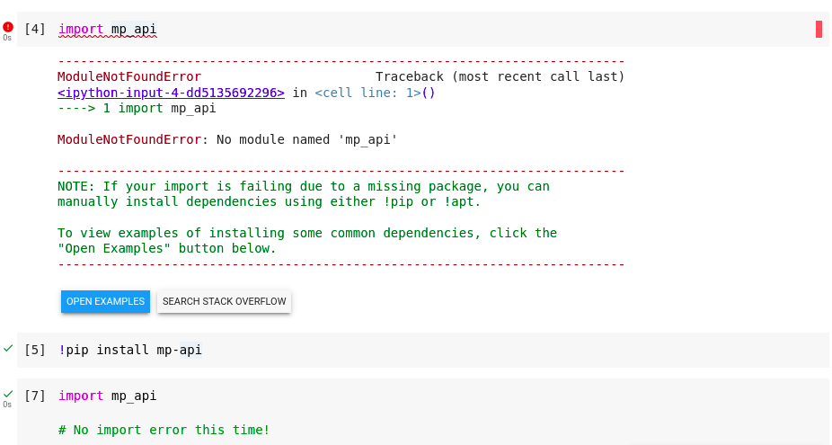
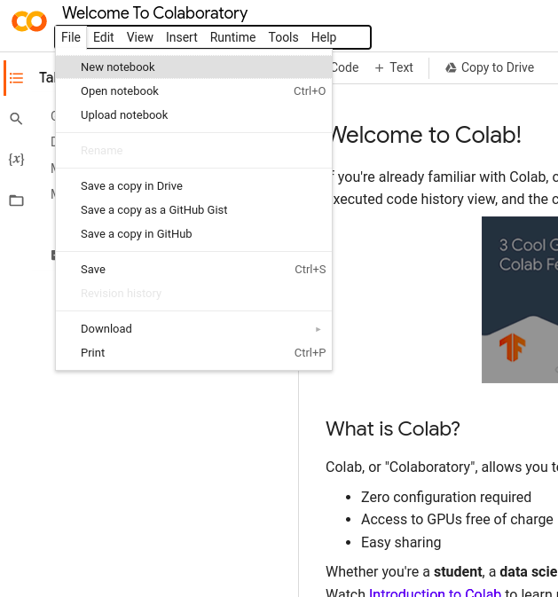
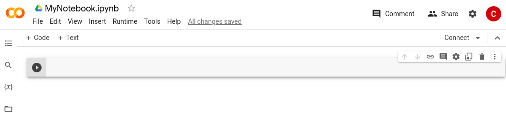

# Getting Started with Python

In this session, we will start by learning some of the basic features of the Python Programming language. Then, we will get our feet wet writing some basic programs.

## What is Python?


Python is a general-purpose programming language originally developed by [Guido van Rossum](https://en.wikipedia.org/wiki/Guido_van_Rossum) in 1989. Since its conception, Python has grown in popularity and is used today in many different computing systems and software technologies. Popular application domains include:

* Networking and web communications
* Web development
* Data science and large-scale data processing
* VR, CGI, and game development
* Scientific Computing

### Why learn Python?

Python is a versatile language that is easy to learn and use, making it an ideal choice for both beginners and experts. It is also a popular language in industry, with many companies relying on Python for a variety of tasks. Python also has a large and supportive community, with many resources available online to help individuals learn and improve their skills. Python’s popularity and flexibility make it a valuable skill to have in today’s job market, with many job postings and research positions requiring or preferring candidates with Python experience. Finally, Python’s extensive library of packages for scientific computing and data analysis, such as NumPy, SciPy, and Matplotlib, make it a powerful tool for tackling complex problems in fields such as physics, chemistry, and engineering.

)](scientific-language-popularity.svg)

Unlike other scientific languages like [MATLAB](https://www.mathworks.com/products/matlab.html) or the [Wolfram Language](https://www.wolfram.com/language/) (Used in [Mathematica](https://www.wolfram.com/mathematica/?source=nav)), Python and its core packages are are _Free and Open-Source_ software. This means that you do not need to purchase specialized software or a license to run Python programs. This also means that as a Python programmer, you are free to view, modify, and extend the source code of these packages to suit your research goals.

## Python Packages

Although the core Python language supports several different data types, many of the features that we will be using in this workshop will come from _python packages_. Python packages are a convenient way for members of the Python community to share Python code that was written to solve a specific problem or that may provide additional code functionality in a specific setting. The avaliability of many different Python packages and the ease of installing them is what makes Python a powerful research tool. Some Python packages that are widely used in scientific computing are:

* `numpy`: An interface to fast mathematical and numerical functions in python, such as arrays, matrices, and common mathematial functions.

* `scipy`: Contains functions commonly used in the analysis of scientific data.

* `matplotlib`: A MATLAB-like interface to plotting and visualizing data in a variety of formats. This package is widely used to create publication-quality figures and plots.

* `pandas`: Used for reading, writing, and manipulating datasets. This package is increasingly being used as an alternative to Microsoft Excel for working with data in Python.

So, how can we use these powerful packages? The Python language comes with an easy-to-use package manager, called ["pip" (Package Installer for Python)](https://pip.pypa.io/en/stable/). Using pip, we can easily install, manage, update, and uninstall packages in our python environment.

### Installing Packages

First, let's try to install the latest version of the `numpy` package. To start, open up a terminal on your system. On most systems can be done by hitting the Start key and searching for the program "Command Prompt" (Windows) or "Terminal" (MacOS, Linux). After running the program, you should see a prompt where you can type in commands.

Type the following command into the terminal and hit Enter:

```
pip install numpy
```

After the installation finishes, you should see no error messages (usually appearing as red text) in the terminal.

:::{important}

On some systems, such as Linux and Mac OS, you may need to instead use the command  `python -m pip install <package>` or `pip3 install <package>`. where `<package>` is the name of the package you want to install. If you are using Anaconda and installing the package with pip does not work, you can try installing it with `conda install <package>`.
:::

Note that if you are using Google Colab, several of the most commonly used packages (such as `numpy`) come pre-installed. However, if you are trying to install a package that does not come pre-installed, you will need to install it by invoking these commands inside the notebook. This works inside Jupyter notebooks also, but it should only be used as a last resort. See the dropdown block below for more details:

:::{admonition} Installing packages inside Google Colab
:class: important, dropdown

If you are using Google Colab, many packages will already be installed for you.

To see if a package is already installed in Google Colab (or in a Jupyter Notebook), try to import it in a Python code cell and see if it imports successfully. You can do this by executing the line:
```
import <package>
```

where `<package>` is the package you want to use. If this fails with a `ModuleNotFoundError`, it means the package is not installed. You can install the package by running a cell with the line:

```
!pip install <package>
```

The `!` at the beginning of the line tells the notebook to run the line as a shell commmand. Be careful when using shell commands within the notebook, since the syntax of these commands may vary from system to system. Only execute shell commands from trusted sources.

Here's an example of installing the [Materials Project client](https://materialsproject.org/api) package (`mp-api`), which has the Python alias `mp_api`:


:::


Now that you we installed numpy, let's try to install some other important packages we need for this workshop. To do this, we will install the rest of the packages from a _requirements file_. A Python requirements file (typically called ``requirements.txt``) is a file that lists all of the packages a project depends on. The packages a project depends on are usually called _dependencies_. For this workshop, we will use the following requirements file:

<script src="https://gist.github.com/cburdine/cae13221fb0e1d134d88a25f01498c67.js"></script>

Note that this is just a text file listing each Python dependency, one per line. Many Python projects will contain `requirements.txt` file in order to list all of the project dependencies. If you were to download this file into your working directory, you could install all depencies using the `pip` command:

```
pip install -r requirements.txt
```

This would automatically install all necessary packages listed in `requirements.txt`. To avoid having to download this file and make sure it ends up in the correct directory, we are going to instead get this requirements file from a URL. To do this, copy the following command and run it in your terminal:

```
pip install -r https://gist.github.com/cburdine/cae13221fb0e1d134d88a25f01498c67/raw/5c0e14277388b5e7318940679e8905c5e847962f/requirements.txt
```

The installation may take a bit of time. Once it finishes, if you do not see a red error message in your console it means that you are now ready to use these packages in your own Python code.

:::{admonition} Advanced Tip: Python Virtual Environments
:class: tip, dropdown
If you are confortable working the the terminal on your system, you may find it helpful to set up a [virtual environment](https://realpython.com/python-virtual-environments-a-primer) for your Python projects. A virtual environment helps with organizing the dependendencies on your system, and ensures that updates to Python packages elsewhere on your system will not override the version used by your project.

If you have the [`venv` tool](https://docs.python.org/3/library/venv.html) installed on your system, you can create a virtual environment for your project by running the following command in your project work directory:

```
python3 -m venv my_env
```

where `my_env` is the name of your environment. To activate your environment, run the following command from your project work directory:

```
source my_env/bin/activate
```

This will activate your environment. Any dependencies installed using `pip` will be installed directly in this environment when it is activated. These installed packages will not be affected by packages installed or updated systemwide or in other virtual environments. To deactivate the virtual environment, simply run the command:
```
deactivate
```
:::


## Using your Python Notebook

To get started running code in your Python Notebook, you will need to start up your Jupyter Notebook environment. Directions are given below for various Operating Systems, or Google Colab, if you are unable to install Jupyter on your device.
::::{tab-set}
:::{tab-item} Windows

The process for starting up you Jupyter notebook wil be different, depending on whether Jupyter Notebook was installed with pip or Anaconda:

**If Jupyter was installed with pip:**

Using your File Explorer, create a new folder to store your Jupyter notebooks. Then do the following steps:
* Inside the empty folder, right click (on some systems: Shift + right click), and click on "Open in Windows Terminal".
* This will open a terminal window inside your folder. Inside the folder, run the command `jupyter notebook` to start the server from inside the folder.

**If Jupyter was installed with Anaconda:**

When launching Jupyter Notebook from Anaconda, notebooks will be saved to the default folder of Anaconda Powershell Prompt. To save the notebooks to a different folder, follow these steps:
* Launch Anaconda Powershell Prompt
* Type  ```mkdir my_jupyter_notebooks ```  to create a folder called `my_jupyter_notebooks` (or a name of your choice) to hold your notebook files and Python code.
* Type ```cd my_jupyter_notebooks``` to enter the folder you just created.
* Type  ```jupyter notebook```  and it will start the server from inside the folder

**Stopping the Server**

Once your Jupyter Notebook server is started, your default web browser should open to the to the Jupyter Noteboook landing page. If it does not open your browser automatically, open your browser and type `localhost:8888` in the address bar.

```{note}
The address `localhost` tells your browser that the server is running on your computer, while `8888` is the port number of your server. If you are running multiple notebook servers simultaneously, the port number of the second server may be different (i.e. `8889`). The port number should be printed in the terminal when the server is started.
```

To stop the server, hit the keys `Ctrl + C` in the command prompt window where the server is running and type `y` to confirm. Be sure you have saved all of your work before stopping the notebook server!
:::

:::{tab-item} Mac OS

If you have Python3 and Jupyter Notebook installed on your system, create a work directory for your jupyter notebooks and make it the current directory (navigate into the new directory). In the terminal, you can do this with the command:

```
mkdir my_jupyter_notebooks && cd my_jupyter_notebooks
```

Once inside your jupyter notebook work directory, you can start the notebook in the terminal using the command:
```
jupyter-notebook .
```

This should start a notebook server, and open your default web browser (typically, Safari) to the Jupyter Noteboook landing page.

If this doesn't happen, not to worry: you can find the URL you need. Return to the terminal and examine the text at the bottom of the window. Look for text like this:
```
[I 20:50:20.174 NotebookApp] Jupyter Notebook 6.5.2 is running at:
[I 20:50:20.174 NotebookApp] http://localhost:8888/?token=e83f9d018eebb7f7d20282104a2710781c84be7227f7fc01
[I 20:50:20.174 NotebookApp]  or http://127.0.0.1:8888/?token=e83f9d018eebb7f7d20282104a2710781c84be7227f7fc01
[I 20:50:20.174 NotebookApp] Use Control-C to stop this server and shut down all kernels (twice to skip confirmation).
[C 20:50:20.200 NotebookApp]

    To access the notebook, open this file in a browser:
        file:///Users/your_account_name/Library/Jupyter/runtime/nbserver-42755-open.html
    Or copy and paste one of these URLs:
        http://localhost:8888/?token=e83f9d018eebb7f7d20282104a2710781c84be7227f7fc01
     or http://127.0.0.1:8888/?token=e83f9d018eebb7f7d20282104a2710781c84be7227f7fc01
```
You'll find here useful information, such as instructions on how to stop the Jupyter server, as well as three URLs, any of which you could paste into your browser's address bar:
* `file:///Users/your_account_name/Library/Jupyter/runtime/nbserver-42755-open.html`
* `http://localhost:8888/?token=e83f9d018eebb7f7d20282104a2710781c84be7227f7fc01`
* `http://127.0.0.1:8888/?token=e83f9d018eebb7f7d20282104a2710781c84be7227f7fc01`, or, most simply,
* `localhost:8888` (or the appropriate, similar number given in your terminal)

```{note}
The address `localhost` tells your browser that the server is running on your computer, while `8888` is the port number of your server. If you are running multiple notebook servers simultaneously, the port number of the second server may be different (i.e. `8889`).
```

To stop the server, hit the keys `Ctrl + C` in the terminal where the server is running and type `y` to confirm. Be sure you have saved all of your work before stopping the notebook server!

:::

:::{tab-item} Linux

If you have Python3 and Jupyter Notebook installed on your system, create a work directory for your jupyter notebooks and navigate inside of it. In the terminal, you can do this with the command:

```
mkdir my_jupyter_notebooks && cd my_jupyter_notebooks
```

Once inside your jupyter notebook work directory, you can start the notebook in the terminal using the command:
```
jupyter-notebook .
```

This should start a notebook server, and open your default web browser to the Jupyter Noteboook landing page. If it does not open your browser automatically, open your browser and type `localhost:8888` in the address bar.

```{note}
The address `localhost` tells your browser that the server is running on your computer, while `8888` is the port number of your server. If you are running multiple notebook servers simultaneously, the port number of the second server may be different (i.e. `8889`). The port number should be printed in the terminal when the server is started.
```

To stop the server, hit the keys `Ctrl + C` in the terminal where the server is running and type `y` to confirm. Be sure you have saved all of your work before stopping the notebook server!
:::

:::{tab-item} Google Colab

In order to use Google Colab, you will need to have a google account. First, navigate to the [Google Colab Landing Page](https://colab.research.google.com/).

To create a new Colab Notebok, click on `File > New Notebook`:



This shoud create a new Notebook with an empty cell where you can start writing your Python code. If you are not logged in to your Google Account, you may be prompted to log in at this time.

By default, your notebook is called "Untitled.ipynb", or something similar. If you click on the name of the notebook at the top lefthand corner, you can rename it to something more meaningful. Your notebook should look something like this:



A Google Colab Notebook functions almost identically to a Jupyter Notebook; however, there are a few minor differences in appearance, keyboard shortcuts, etc. These are the most important differences to keep in mind:

* Instead of saving to your computer's local storage, Google Colab will save your notebooks to your Google Drive. If you want to download a notebook to open in Jupyter, click on `File > Download > Download .ipynb`. If you want to upload a Jupyter notebook to Colab, click on `File > Upload Notebook`.

* The code in a Google Colab notebook is executed remotely on Google's servers, not your computer. This means that you must have an internet connection to be able to run your code.

* You can also run a Google Colab Notebook on Google's GPU (Graphics Processing Unit) and TPU (Tensor Processing Unit) hardware. You can run your code for free on [NVIDIA Tesla T4](https://www.nvidia.com/en-us/data-center/tesla-t4/) hardware or Google's Proprietary [TPU Hardware](https://cloud.google.com/tpu/docs/intro-to-tpu). Higher-end hardware is also available for a fee. In this workshop, we will probably not need to use any hardware acceleration.

:::
::::
