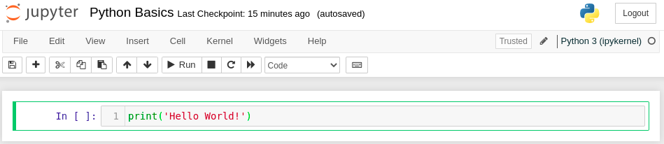
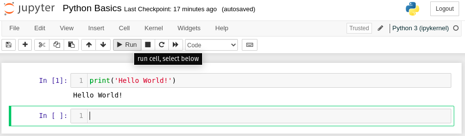

---
jupytext:
  text_representation:
    extension: .md
    format_name: myst
kernelspec:
  display_name: Python 3
  language: python
  name: python3
---

# Python Basics

Now that we have our notebook up and running, let's start writing some Python code. 

## The Print Function

The first thing we will learn about is how to use the `print` function. The `print` function lets us output a representation of any object in Python as text. To start, let's use the `print` function to output the text ``'Hello World!'``. To do this, click on the first cell in the notebook and type the following:

```
print('Hello World!')
```

If you don't see an empty cell to type your code into, click on the **+** button at the top lefthand corner to create a new empty cell. Your notebook should now look something like this:



To execute this cell, click on the cell to make sure it is selected (indicated by the green border). Then click the "Run" button. Your notebook should now show the output `Hello World` below the cell:



Altogether, the combined input and output of the first cell should look like this:

```{code-cell} ipython3
print('Hello World')
```

Congratulations, you have just written your first Python program, using the `print` function!

:::{tip}
To execute a selected notebook cell, you can also use the keyboard shortcut `Shift + Enter`. To learn more about keyboard shortcuts in your Jupyter Notebook, click on `Help > Keyboard Shortcuts`.
:::

## Arithmetic

We can also use the `print` function to output the result of a mathematical expression containing operations such as addition, subtraction, multiplication, and division. Try typing the following code into the next cell of your notebook and running it. You should get the same output as indicated:

```{code-cell}
print(1 + 1)
print(2 - 5)
print(3 * 8)
print(43 / 7)
```

Python also has an exponentiation operation `**`. To see how this works, run the following cell in your notebook:

```{code-cell}
print(3 ** 2)
print(49 ** 0.5)
print(10 ** -3)
```

You can also combine multiple math operations together and enclose expressions in parentheses. Python will evaluate them according to the standard order of operations:

* Parentheses-enclosed expressions
* Exponents
* Division (left to right), then multiplication
* Subtraction (left to right), then addition

To avoid ambiguity, it is usually a good idea to use parentheses to make your arithmetic easier to read. For example, to evaluate the expression

$$ 3 \cdot \left( \frac{20}{5}\right)^{3} - (0.125) \cdot \sqrt[4]{64} $$

we would write:

```{code-cell}
print( (3 * (20 / 5)**3) - (0.125 * 64**(1/4)) )
```

## Commenting your Code

When writing code, it is usually a good idea to add comments. Comments are lines of explanatory text that have no effect on the execution of Python code, but are still a crucial element of writing high-quality Python code that others can understand. In Python, anything that follows the `#` symbol on a line of code is considered to be a comment. Good comments usually explain what is happening on the same line or on the following lines of code. For example, try running the following lines in your notebook:

```{code-cell}
print('Approximations of Pi:') # Print title text

# print the actual value of pi (to 10 decimal places):
print(3.1415926535)

# print an estimated value of pi using the arctan Taylor expansion:
#  pi = 4 * arctan(1) ~ 4*(1 - 1/3 + 1/5 - 1/7  + ...)
print(4 * (1 - 1/3 + 1/5 - 1/7 + 1/9 - 1/11 + 1/13))

```
Even if you don't understand what the Taylor expansion of $\arctan(x)$ is, the comments still clearly describe the intent behind each of the `print` statements. If these comments weren't present in the code, we would probably have difficulty understanding what is going on. This shows that adding good comments to your code is almost as important as the code itself. Even if you think you will be the only one reading or modifying your code in the future, adding comments is still very important, as it can make your code immune to the scourge known as [_Eagleson's Law_:

```{epigraph}
"Any code of your own that you haven’t looked at for six or more months, might as well have been written by someone else."

-- Eagleson's Law
```

In other words, comments provide a kind of scaffolding that can help you orient yourself when writing your code. If written clearly, they will help you and your peers understand your thought process when reading your code.

:::{note}

Python comments can also be written using triple quotes, for example:
```
""" This is a comment. """
```
These are a special type of comment called a _Docstring_. We will return to these later in the workshop.
:::

## Types in Python

By now, you may be wondering about the different types of data that can go inside a `print(...)` statement, and how they are displayed in the output. In the first `print` statement example, we enclosed some text in single quotes (i.e. `'...'`) and used that as the argument to the print statement `print('Hello World!')`. This text is an example of the _string_ type in Python. A string is mathematical term for a sequence of symbols or text characters. In Python, we refer to strings with the abbreviated keyword `str`. You may have also noted that some of the print statements above output integers (i.e. numbers without decimal points) or real numbers (numbers with decimal points). To see this more clearly, try running the following code:

```{code-cell}
# These evaluate to "7"
print(7)
print(4 + 3)

# These lines evaluate to "7.0":
print(7.0)
print(21 / 3)
print(49**(0.5))
```

So why do the first two lines evaluate to `7` and the last three lines evaluate to `7.0`? Although these printed values are effectively the same, the underlying _types_ of the printed values differ. Specifically, the first two printed values are of the `int` (short for _integer_) type, while the last three values have the `float` type (short for [floating-point](https://en.wikipedia.org/wiki/Decimal_floating_point) numbers). 

The reason that Python differentiates between these two types of numbers has to do with the fact that a computer can represent any integer with a finite number of symbols. (We humans use the [base-10 arabic numeral system](https://en.wikipedia.org/wiki/Arabic_numerals), whereas our computers use 1s and 0s in a [binary system](https://en.wikipedia.org/wiki/Binary_number).) However, some numbers (such as the mathematical constant $\pi$) have an infinite decimal representation, and cannot be stored exactly in a computer. Instead, the precision of the value must be rounded off to a certain number of decimal points. For Python `float` types, numbers are represented using a kind of scientific notation (e.g. $1.23456 \cdot 10^{-20}, 3.14159256 \cdot 10^{0}$) but with binary. On most platforms, Python `floats` contain [roughly  17 significant digits of precision](https://docs.python.org/3/tutorial/floatingpoint.html), which is more than enough for most scientific applications.

In Python, we can view the type of any object using the `type` function. Let's see what happens when we invoke the `type` function on several different values:

```{code-cell}

# print the type of string (str) objects:
print(type('Hello World'))
print(type('This is some text of the "str" type.'))
print(type('')) # <-- '' is the empty string

# print the type of integer (int) objects:
print(type(42))         # 42
print(type(1 - 7))      # -6
print(type(3 * 13))     # 39

# print the type of floating-point (float) objects:
print(type(2 * 10**-9)) # 2.0e-9 
print(type(1.0))        # 1.0 (!)
print(type(42 / 6))     # 7.0 (!)
print(type(16**(-2)))   # 4.0 (!)
```

For the last few lines of the code cell (with `(!)` in the comments) note that even though the resulting values are effectively integers, the types are still `float`. The reason is that Python automatically converts the result of all division (`/`) and most exponentiation (`**`) operations to `float`s, even if the results are in fact integers. We also see that any value given with a trailing `.0` is interpreteted by Python as a `float` type.

In addition to the `float` type, which stores real numbers, Python also has the `complex` type for storing complex numbers of the form $z = a + bi$, where $a$ and $b$ are real numbers and $i = \sqrt{-1}$ is the imaginary constant. To denote complex numbers in Python, we use the same $a + bi$ syntax, but we use the suffix `j` instead of $i$ to denote the imaginary part of the number:

```{code-cell}
# examples of complex numbers:
print(1.0j)
print(3 - 4j)
print((-1)**0.5)

# print the type of complex number objects:
print(type(1.0j))
print(type(3 - 4j))
print(type((-1)**0.5))
```


## Variables

When doing calculations in Python, it is often necessary to break up the calculation into multiple steps. We can store the results of these intermediate steps using a _variable_. A variable is simply a named object capable of storing a value. For example, let's create a variable called `x` and use it for evaluating the polynomial function $y(x) = 10x^2 + 3x + 4$. To assign a value to a Python variable, we use the assignment operator `=`. Try typing out the following example in a cell in your notebook:

```{code-cell}
x = 3 # assign a value of 3 to "x"

# compute the value of y(x), assign "y" to the result:
y = 10*(x**2) + 3*x + 4

# print the result stored in the "y" variable:
print(y)
```
In Python, variables can be used to store the value of an object of any type (whether `str`, `int`, `float`, or any other type we will learn about in the future). As the example above shows, we can perform some computation on one variable (i.e. `x`) and store that result in another varible (i.e.`y`).

:::{important}
It might be tempting to think of the assignment operator `=` as a mathematical equality operator $=$. This is not a correct way to think of the `=` operator, since matematical equality is symmetric (i.e. $x = y$ and $y = x$ are identical statements), whereas the assignment operator is not symmetric. 
In Python, `x = y` assigns the value of the variable `y` to `x`, overriding the previous value of `x`, wheras `y = x` does the reverse, overriding the previous value of `y` with the value of `x`.
:::

When creating variables, it is encouraged that you pick names for your variables that best reflect the kind of value that they hold. Your variable names should also abide by the conventions of the programming language your code is written in. Here are some general guidelines for selecting good variable names:

* If possible, use all lowercase variable names. Since variable names cannot contain spaces, use an underscore character (`_`) to separate words in the name.
* Variable names may contain numbers too, but they cannot start with a number.

For example, the variable names

```
pi_approximation = 3.14
number_of_steps = 100
name = 'James T. Kirk'
```

all abide by good Pythonic conventions. There are some exceptions to this convention, such as _global variables_, which are variables that effectively serve as constants. Global variables are usually represented in all capital letters with underscores. For example:

```
PLANCK_CONSTANT = 6.626 * 10**(-34) # Planck constant (h) in J/Hz
MEANING_OF_LIFE = 42                # The meaning of Life, the universe, and everything.
```

:::{seealso}
If you want to learn more about good Python naming conventions see the Python [PEP-8 documentation](https://peps.python.org/pep-0008/).
:::

## Exercises

Let's take a moment to apply what we have learned so far. Try to do each of the following exercises:

:::{dropdown} Exercise 1: Golden Ratio
Write some code to print out the constant known as the [_Golden Ratio_](https://en.wikipedia.org/wiki/Golden_ratio). The golden ratio $\varphi$ is given by:

$$\varphi = \frac{1 + \sqrt{5}}{2}$$
:::

:::{dropdown} Exercise 2: Quadratic Formula
Consider a quadratic polynomial of the form


$$y(x) = ax^2 + bx + c$$

Suppose that the values of $a$, $b$, and $c$ are stored in the python variables `a`, `b`, and `c`. Write some code that prints out the roots of $y(x)$, that is, the points $x$ where $y(x) = 0$. You may find it helpful to use the [quadratic equation](https://en.wikipedia.org/wiki/Quadratic_equation):

$$x = \frac{-b \pm \sqrt{b^2 - 4ac}}{2a}$$

Keep in mind that the roots $x$ may be complex numbers.
:::

### Solutions

#### Exercise 1: Golden Ratio

```{code-cell}
:tags: [hide-cell]
# compute the golden ratio:
golden_ratio = (1 + 5**(1/2))/2

# print the result:
print(golden_ratio)
```

#### Exercise 2: Quadratic Equation

```{code-cell}
:tags: [hide-cell]
# initialize values for a,b,c:
a = 3.0
b = 2.0
c = 1.0

# compute x +/- solutions with quadratic equation:
x_plus = (-b + (b**2 - 4*a*c)**(1/2)) / (2*a)
x_minus = (-b - (b**2 - 4*a*c)**(1/2)) / (2*a)

# print results:
print(x_plus)
print(x_minus)
```
