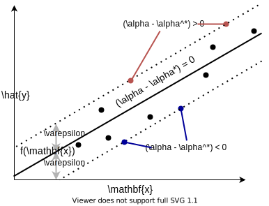

---
jupytext:
  text_representation:
    extension: .md
    format_name: myst
kernelspec:
  display_name: Python 3
  language: python
  name: python3
---

# Kernel Machines

In this section, we will introduce a powerful and popular class of regression and classification models known as _kernel machines_. Kernel machines are an extension of the high-dimensional embedding models of the form:

$$\hat{y} = f(\mathbf{x}) = w_0 + \sum_{i=1}^{D_{emb}} w_i\phi_i(\mathbf{x})$$ 

As we will see, kernel machines can even be used to compute functions where $D_{emb} = \infty$ (i.e. the data is embedded in an infinite-dimensional space). This is achieved through computing only the inner products between data points, given by a _kernel function_ $K(\mathbf{x}, \mathbf{x}')$.

## Maximum Absolute Error Regression:

In order to understand kernel functions, it is helpful to first examine the problem of maximum absolute error regression. The goal of this regression model is to find the simplest high-dimensional embedding model (i.e. the one with the minimal sum of weights squared) subject to the constraint that the maximum absolute error of all predictions in the training set lie within an error tolerance value $\varepsilon$. Formally, we write this optimization problem as:

$$\text{minimize: }\ \sum_i^{D_{emb}} w_i^2\ \text{ subject to: }\  \max_n |\hat{y}_n - y_n| < \varepsilon $$

This is an instance of a _Lagrange multiplier problem_, which we can re-write in standard form.

:::{admonition} Note: Lagrange Multiplier Problems
:class: note, dropdown

A Lagrange multiplier problem is an optimization problem concerning the optimization of an objective function $f$ subject to a set of constraint functions $g$. Such a problem is in _standard form_, if it can be written as follows:

$$\text{minimize: }\ f(\mathbf{w})\ \text{ subject to: }\ \begin{cases} g_1(\mathbf{w}) \le 0 \\ g_2(\mathbf{w}) \le 0 \\ \dots  \\ g_k(\mathbf{w}) \le 0 \end{cases}$$

The _Lagrangian_ of this problem is the function:

$$\mathcal{L}(\mathbf{w}) = f(\mathbf{w}) + \sum_{i=1}^k \lambda_i g_i(\mathbf{w})$$

where the $\lambda_i$ are variables called _Lagrange multipliers_. It can be shown that all local minima and maxima of $f(\mathbf{w})$ must satisfy the equation:

$$\nabla_w \mathcal{L}(\mathbf{w}) = 0$$

This equation, along with the constraints $g(\mathbf{w})$ can be used to determine the multipliers $\lambda_i$ and the associated points $\mathbf{w}$ where $f$ attains local maxima and minima. Under certain regularity conditions (see [Slater's condition](https://en.wikipedia.org/wiki/Slater%27s_condition)) it can be shown that the local minima of the problem correspond to solutions of the [_dual optimization problem_](https://en.wikipedia.org/wiki/Duality_(optimization)#Dual_problem):

$$\text{maximize: }\ \mathcal{L}(\mathbf{w})\ \text{ subject to: }\ \nabla_w \mathcal{L}(\mathbf{w}) = 0,\ \text{ and }\  \lambda_1, \lambda_2, ..., \lambda_k \ge 0$$
:::

Writing the maximum absolute error regression problem in the standard form of a Lagrange multiplier problem, we obtain:

$$\begin{aligned}
\text{minimize: } &  \frac{1}{2}(\mathbf{w}^T\mathbf{w})\\
 \text{ subject to: } & \begin{cases} 
\left(w_0 + \sum_{i=1}^{D_{emb}} w_i\phi_i(\mathbf{x}_n) - y_n\right) - \varepsilon \le 0\\
-\left(w_0 + \sum_{i=1}^{D_{emb}} w_i\phi_i(\mathbf{x}_n) - y_n\right) - \varepsilon \le 0 \\
\end{cases}
\ \text{ for $n = 1, 2, ..., N$}
\end{aligned}$$

Note that we have added a coefficient of $1/2$ to the objective function, which does not affect the solution to the optimization problem. In total, this problem has $k=2N$ constraint functions, which means that we must introduce a total of $2N$ Lagrange multipliers. Letting $\alpha_1, \alpha_2, ..., \alpha_n$ and $\alpha_1^*, \alpha_2^*, ..., \alpha_n^*$ be the Lagrange multipliers of the top and bottom set of constraints respectively, the Lagrangian function with respect to the weights $\mathbf{w}$ is:

$$\mathcal{L}(\mathbf{w}) = \frac{1}{2}(\mathbf{w}^T\mathbf{w}) + \sum_{n=1}^N \left[ (\alpha_n - \alpha_n^*)\left(w_0 + \sum_{i=1}^{D_{emb}} w_i \phi_i(\mathbf{x}_n) - y_n\right) - (\alpha_n + \alpha_n^*)\varepsilon \right]$$

:::{important}
A couple of notation warnings for physicists: 
1. The notation $\alpha_n^*$ does not denote the complex conjugate here; the Lagrange multipliers $\alpha_n$ and $\alpha_n^*$ are independent real scalar values.
2. The "Lagrangian" function used here is unrelated to the Lagrangian operator $\mathcal{L} = \mathcal{T} - \mathcal{V}$, though both of these formalisms are attributed to [Lagrange](https://en.wikipedia.org/wiki/Joseph-Louis_Lagrange). (Same guy, different crime).
::: 

Setting the gradient of the Lagrangian equal to $\mathbf{0}$, we obtain an expression for the weights $\mathbf{w}$:

$$\nabla_w \mathcal{L}(\mathbf{w}) = \mathbf{0}\qquad \Rightarrow \qquad  w_i = \sum_{n=1}^N (\alpha_n - \alpha_n^*)\phi_i(\mathbf{x}_n)$$

To ensure a solution exists to our optimization problem, we impose the following additional constraints on the Lagrange multipliers:

$$ \sum_{n = 1}^N (\alpha_n - \alpha_n^*) = w_0,\qquad   0 \le \alpha_n, \alpha_n^* \le C$$

The first constraint follows from $\nabla_w\mathcal{L}(\mathbf{w}) = \mathbf{0}$, while the second constraint bounds the Lagrange multipliers by a regularization parameter $C$. After imposing these constraints and eliminating $\mathbf{w}$ from the Lagrangian, we obtain the following [_dual formulation_](https://en.wikipedia.org/wiki/Duality_(optimization)#Dual_problem) of the problem (which we have re-written as a minimization problem):

$$\begin{aligned}
\text{minimize: } &  \frac{1}{2}\mathbf{a}^T\mathbf{G}\mathbf{a} - \mathbf{a}^T\mathbf{y} + \varepsilon\left(\sum_{n=1}^N (\alpha_n + \alpha_n^*)\right)\\
 \text{ subject to: } & \begin{cases} 
\sum_{n=1}^N (\alpha_n - \alpha_n^*) = w_0 \\
0 \le \alpha_n, \alpha_n^* \le C 
\ \text{ for $n = 1, 2, ..., N$}
\end{cases}
\end{aligned}$$

Above $\mathbf{G} = \mathbf{\Phi}(\mathbf{X})^T\mathbf{\Phi}(\mathbf{X})$ and $\mathbf{a} = \begin{bmatrix} (\alpha_0 - \alpha_0^*) & (\alpha_1 - \alpha_1^*) & \dots & (\alpha_N - \alpha_N^*) \end{bmatrix}^T$. The matrix $\mathbf{G}$ is called a [Gram matrix](https://en.wikipedia.org/wiki/Gram_matrix). It is a symmetric $N \times N$ matrix containing the inner product of every data point $\mathbf{x}$ with every other data point $\mathbf{x}$ in the embedding space. The function that computes this inner product is called a _kernel function_ $K: \mathcal{X} \times \mathcal{X} \rightarrow \mathbb{R}_{\ge 0}$. Specifically, the entries of $\mathbf{G}$ are given by:

$$ \mathbf{G}_{mn} = 1 + \sum_{i=1}^{D_{emb}} \phi_i(\mathbf{x}_m)\phi_i(\mathbf{x}_n) = 1 + K(\mathbf{x}_m, \mathbf{x}_n)$$ 

where the kernel function $K(\mathbf{x},\mathbf{x}')$ is defined as:

$$K(\mathbf{x}, \mathbf{x}') = \sum_{i=1}^{D_{emb}} \phi_i(\mathbf{x})\phi_i(\mathbf{x}')$$

While the kernel function $K(\mathbf{x},\mathbf{x}')$ can be concretely interpreted as the inner product of $\mathbf{x}$ and $\mathbf{x}'$ in the embedding space, we can abstractly think of $K$ as a measure of "similarity" between two points $\mathbf{x}$ and $\mathbf{x}'$. The higher the value of $K(\mathbf{x},\mathbf{x}')$, the more similar $\mathbf{x}$ is to $\mathbf{x}'$.

:::{important}
In most software packages, the $y_1,y_2, ..., y_N$ values are normalized prior to solving the dual problem to ensure that $w_0 = 0$ (this ensures that the regularization parameter $C$ does not bound the bias weight $w_0$). Because $w_0 = 0$, the leading column of $1$s in the embedding matrix $\mathbf{\Phi}(\mathbf{X})$ is unnecessary, and is thus removed. This results in a Gram matrix $\mathbf{G}$ with entries:

$$\mathbf{G}_{mn} = \sum_{i=1}^{D_{emb}} \phi_i(\mathbf{x}_m)\phi_i(\mathbf{x}_n) = K(\mathbf{x}_m, \mathbf{x}_n)$$
:::

Solving the dual formulation of the maximum absolute error regression problem can be accomplished through one of a number of algorithms, such as the [_sequential minimal optimization_ (SMO)](https://www.microsoft.com/en-us/research/publication/sequential-minimal-optimization-a-fast-algorithm-for-training-support-vector-machines/) algorithm.

## Support Vectors

From studying the maximum absolute error regression problem, we found that the optimal weights $w_i$ satisfy the relationship $w_i = \sum_n (\alpha_n - \alpha_n^*)\phi_i(\mathbf{x}_n)$. Using the definition of the kernel function $K(\mathbf{x},\mathbf{x}')$, we find that that we can re-write an embedding model in terms of a sum of the kernel function applied to each data point $\mathbf{x}_n$ in the training dataset:

$$ f(\mathbf{x}) = w_0 + \sum_{i=1}^{D_{emb}} w_i\phi_i(\mathbf{x})\quad \Rightarrow \quad f(\mathbf{x}) = w_0 + \sum_{n=1}^N (\alpha_n - \alpha_n^*)K(\mathbf{x}_n,\mathbf{x})$$

This is an important result, as it allows us to quantitatively measure the "importance" of each datapoint $\mathbf{x}_n$ in training the model by examining the values of $(\alpha_n - \alpha_n^*)$. Furthermore, it also allows us quantify how each of the training datapoints $\mathbf{x}_n$ contribute to predictions made on an unseen datapoint $\mathbf{x}$. This contribution is the product of $(\alpha_n - \alpha_n^*)$ (the "importance" of $\mathbf{x}_n$) and $K(\mathbf{x}_n,\mathbf{x})$ (the "similarity" of $\mathbf{x}_n$ and $\mathbf{x}$).

Recall that the $\alpha_n$ and $\alpha_n^*$ are Lagrange multipliers corresponding to the constraint $|f(\mathbf{x}_n) - y_n| \le \varepsilon$. In Lagrange multiplier problems, if the optimal solution has $\lambda_i = 0$ for any multiplier $\lambda_i$, it means that the solution does not lie on the boundary of the corresponding constraint $g_i(\mathbf{w}) = 0$. So, if $\alpha_n = \alpha_n^* = 0$, it means that the constraint $|\hat{y} - y| < \epsilon$ was not necessary in fitting the model. In other words, the points with $|(\alpha - \alpha^*)| > 0$ are the only points that were "important" in finding the best fit of the model. These points are called _support vectors_. In the simple case of a linear model, the points with $(\alpha - \alpha^*) \neq 0$ are the points that lie above and below the $f(x) \pm \varepsilon$ region, as shown in the illustration below:



## Kernel Functions

One practical trade-off that we experience when transitioning from an embedding model to an equivalent kernel-based model (often called a _kernel machine_) is that in order to compute a prediction $f(\mathbf{x})$, we are shifting from a computation that involves a summation of $D_{emb}$ terms to a computation that can involve up to $N$ terms, where $N$ is the size of the dataset. Fortunately, the summation only needs to carried out over the support vectors where $(\alpha_n - \alpha_n^*)$ is nonzero:

$$ f(\mathbf{x}) = \sum_{\{ n:~(\alpha_{n} - \alpha_{n}^*) = 0 \}} (\alpha_n - \alpha_n^*)K(\mathbf{x}_n - \mathbf{x}) $$

Depending on the type of the kernel function $K$, the tolerance factor $\varepsilon$, and the size of the dataset, the number of support vectors may be large or small. When working with kernel machines, it is common to try out multiple kernels, and select the best fit that strikes a balance between model accuracy and the number of support vectors. Below are some kernels that are commonly used:

* Linear Kernel:

$$K(\mathbf{x}, \mathbf{x}') = \mathbf{x}^T\mathbf{x}'$$

* Polynomial Kernel (degree $d$):

$$K(\mathbf{x}, \mathbf{x}') = (\gamma (\mathbf{x}^T\mathbf{x}') + r)^d$$

* Radial Basis Function (RBF) Kernel:

$$K(\mathbf{x}, \mathbf{x}') = \exp(-\gamma\lVert \mathbf{x} - \mathbf{x}'\rVert)$$

* Parameterized $L^2$ function Kernel:

$$K(\mathbf{x}, \mathbf{x}') = \int_{-\infty}^\infty f_{\mathbf{x}}(s)f_{\mathbf{x}'}(s)\ ds$$

:::{admonition} Advanced Tip: Quantum Mechanics Problems and the $L^2$ Kernel
:class: tip, dropdown

The parameterized $L^2$ function kernel is similar to the wave function inner product you may have encountered in a quantum mechanics course, i.e:

$$K(\mathbf{x},\mathbf{x}') \sim \langle \psi_\mathbf{x} | \psi_{\mathbf{x}'} \rangle = \int \psi_\mathbf{x}^*(s) \psi_{\mathbf{x}'}(s)\ ds$$

This kernel can be used in a variety of solid state physics problems involving the electronic structure of materials. For example, $\mathbf{x}$ could be a vector representing a linear combination of atomic orbitals. We note, however, that additional care must be taken when working with kernel functions that are complex-valued.

Kernel machines are also currently being explored in the field of [_Quantum Machine Learning_](https://en.wikipedia.org/wiki/Quantum_machine_learning), which seeks to integrate quantum computation with existing classical machine learning. Quantum Kernel machines naturally make use of the $L^2$ kernel, and appear to be promising model for predicting quantum mechanical properties of materials. Unfortunately, quantum computers have yet to reach the scale necessary to apply machine learning algorithms to large datasets.
:::

Recall that the kernel function $K(\mathbf{x},\mathbf{x}')$ computes the inner product of two data points embedded in $D_{emb}$-dimensional space. Remarkably, it can be shown that for some kernel functions, such as RBF kernel and the $L^2$ kernel, the embedding space has dimension $D_{emb} = \infty$! This means that when we fit a kernel machine using these kernels, we are actually performing linear regression in an infinite dimensional space, which is impossible to do with a traditional linear regression model. This neat little result is called the ["_kernel trick_"](https://en.wikipedia.org/wiki/Kernel_method#Mathematics:_the_kernel_trick).

## Support Vector Regression

Although the theory of support vector regression and other types of kernel machines is quite complex, using them in practice is quite easy. The `sklearn` library contains a several different kernel machine models that we can integrate into our Python code. Many different kernels are also supported. For example, to fit a support vector regression model with a linear kernel, we can use [`sklearn.svm.SVR`](https://scikit-learn.org/stable/modules/generated/sklearn.svm.SVR.html) as shown in the following code:

```{code-cell}
:tags: [hide-input]
import numpy as np
import matplotlib.pyplot as plt
from sklearn.svm import SVR

# generate dataset:
data_x = np.linspace(-2,2,30)
data_y = 0.5*data_x + 0.5*np.sin(4*data_x)

# fit a linear support vector regression (SVR) model:
svr_epsilon=0.25
svr = SVR(kernel='linear', epsilon=svr_epsilon)
svr.fit(data_x.reshape(-1,1), data_y)

# evaluate SVR predictions:
eval_x = np.linspace(-2,2, 100)
eval_yhat = svr.predict(eval_x.reshape(-1,1))

# plot SVR predictions:
plt.figure(figsize=(7,3.5))
plt.plot(eval_x, eval_yhat, 'k', label=r'$f(x)$ (linear kernel)')
plt.plot(eval_x, eval_yhat+svr_epsilon, 'k:', 
         alpha=0.5, label=r'$f(x) \pm \varepsilon$')
plt.plot(eval_x, eval_yhat-svr_epsilon, 'k:', alpha=0.5)
plt.scatter(data_x, data_y, c='k', alpha=0.1, label='Dataset')
sv_plot = plt.scatter(data_x.take(svr.support_).flatten(),
            data_y.take(svr.support_), c=svr.dual_coef_, 
            marker='+', cmap='bwr', label='Support Vectors')
plt.colorbar(sv_plot, label=r'$(\alpha_n - \alpha_n^*)/C$')
plt.ylabel('y')
plt.xlabel('x')
plt.title('Linear Suport Vector Regression')
plt.legend()
plt.show()
```

## Exercises

:::{dropdown} Exercise 1: Support Vector Regression:
Let's play with some Support Vector Regression (SVR) models. These models are fit by solving the
same maximum absolute error regression problem we discussed above. One benefit of using SVR models
is that it is very easy to try different kinds of embeddings (including infinite-dimensional ones)
simply by swapping out kernels.

Consider the following (randomly generated) 2D dataset:
```
import numpy as np

# Generate training dataset:
data_x = np.array([ 
    np.random.uniform(0,10, 400),
    np.random.uniform(-2e-2,2e-2, 400)
]).T
data_y = np.cos((data_x[:,0]-5)**2/10 + (100*data_x[:,1])**2)
```

Plot the dataset, and fit three different SVR models to the data with [`sklearn.svm.SVR`](https://scikit-learn.org/stable/modules/generated/sklearn.svm.SVR.html). Use the following kernels:

1. linear kernel (`SVR(kernel='linear')`)
2. second degree polynomial kernel (`SVR(degree=2,kernel='poly')`)
3. radial basis function kernel (`SVR(kernel='rbf')`)

Finally, for each kernel function, plot the prediction surface. You can do this with the following Python function:

```
def plot_model_predictions(data_x, model, x_scaler=None, title=None):
    """
        Plots the prediction surface of a model with 2D features.

        Args:
            data_x: the 2D data (numpy array with shape (N,2))
            model: an sklearn model (fit to normalized `data_x`)
            x_scaler: an sklearn.preprocessing.StandardScaler
                      for normalizing the `data_x` data array
                      (optional)
            title: title of plot (optional)
    """
    mesh_x1, mesh_x2 = np.meshgrid(
        np.linspace(np.min(data_x[:,0]),np.max(data_x[:,0]), 100),
        np.linspace(np.min(data_x[:,1]),np.max(data_x[:,1]), 100)
    )

    mesh_x = np.array([ mesh_x1.flatten(), mesh_x2.flatten() ]).T
    mesh_z = x_scaler.transform(mesh_x) if x_scaler else mesh_x

    pred_y = model.predict(mesh_z)
    mesh_yhat = pred_y.reshape(mesh_x1.shape)

    plt.figure()
    cnt = plt.contourf(mesh_x1, mesh_x2, mesh_yhat, levels=20)
    plt.colorbar(cnt, label=r'$\hat{y}$')
    plt.xlabel(r'$x_1$')
    plt.ylabel(r'$x_2$')
    plt.title(title if title else str(model))
    plt.show()
```
:::


:::{dropdown} Exercise 2: Kernel Support Vector Classification

Kernel machines can also be used for the task of classification. In this exercise, we will get some practice working with support vector classification models. 

Repeat Exercise 1, but using Support Vector Classifier models (see [`sklearn.svm.SVC`](https://scikit-learn.org/stable/modules/generated/sklearn.svm.SVC.html)). Use the SVCs to fit the following training data:

```
import numpy as np

# Generate training dataset:
data_x = np.array([ 
    np.random.uniform(0,10, 400),
    np.random.uniform(-2e-2,2e-2, 400)
]).T
data_y = np.cos((data_x[:,0]-5)**2/10 + (100*data_x[:,1])**2)
```

Above, `data_y` contains +1 values for the positive class and -1 values for the negative class. Use the same three kernels as in Exercise 1:

1. linear kernel (`SVC(kernel='linear')`)
2. second degree polynomial kernel (`SVC(degree=2,kernel='poly')`)
3. radial basis function kernel (`SVC(kernel='rbf')`)

To plot the prediction surfaces of the classifier, you can use the same `plot_model_predictions` function as in Exercise 1.

:::

### Solutions

#### Exercise 1: Support Vector Regression

```{code-cell}
:tags: [hide-cell]
import numpy as np
import matplotlib.pyplot as plt

from sklearn.svm import SVR
from sklearn.preprocessing import StandardScaler

# Generate training dataset:
data_x = np.array([ 
    np.random.uniform(0,10, 400),
    np.random.uniform(-2e-2,2e-2, 400) 
]).T
data_y = np.cos((data_x[:,0]-5)**2/10 + (100*data_x[:,1])**2)

# plot training dataset:
plt.figure()
sp = plt.scatter(data_x[:,0], data_x[:,1], c=data_y, label='Dataset')
plt.colorbar(sp, label=r'$y$')
plt.xlabel(r'$x_1$')
plt.ylabel(r'$x_2$')
plt.legend()
plt.show()

def plot_model_predictions(data_x, model, x_scaler=None, title=None):
    """
        Plots the prediction surface of a model with 2D features.

        Args:
            data_x: the 2D data (numpy array with shape (N,2))
            model: an sklearn model (fit to normalized `data_x`) 
            x_scaler: an sklearn.preprocessing.StandardScaler
                      for normalizing the `data_x` data array
                      (optional)
            title: title of plot (optional)
    """
    mesh_x1, mesh_x2 = np.meshgrid(
        np.linspace(np.min(data_x[:,0]),np.max(data_x[:,0]), 100),
        np.linspace(np.min(data_x[:,1]),np.max(data_x[:,1]), 100)
    )

    mesh_x = np.array([ mesh_x1.flatten(), mesh_x2.flatten() ]).T
    mesh_z = x_scaler.transform(mesh_x) if x_scaler else mesh_x
    
    pred_y = model.predict(mesh_z)
    mesh_yhat = pred_y.reshape(mesh_x1.shape)
    
    plt.figure()
    cnt = plt.contourf(mesh_x1, mesh_x2, mesh_yhat, levels=20)
    plt.colorbar(cnt, label=r'$\hat{y}$')
    plt.xlabel(r'$x_1$')
    plt.ylabel(r'$x_2$')
    plt.title(title if title else str(model))
    plt.show()

# fit a StandardScaler to data:
scaler = StandardScaler()
scaler.fit(data_x)

# normalize x_data:
data_z = scaler.transform(data_x)

# These are the regression models we are trying:
svr_models = [
    SVR(kernel='linear'),
    SVR(kernel='poly', degree=2),
    SVR(kernel='rbf'),
]

# fit each model and plot the prediction surface:
for svr_model in svr_models:
    
    # fit model to normalized data:
    svr_model.fit(data_z, data_y)
    
    # plot predictions made by kernel SVR model
    plot_model_predictions(data_x, 
                           model=svr_model, 
                           x_scaler=scaler,
                           title=f'SVR ({svr_model.kernel} kernel)')
    
     
```

#### Exercise 2: Support Vector Classification

```{code-cell}
:tags: [hide-cell]
import numpy as np
import matplotlib.pyplot as plt

from sklearn.svm import SVC
from sklearn.preprocessing import StandardScaler

# !! Note: This uses the plot_model_predictions function from Exercise 1.


# Generate training dataset:
data_x = np.array([ 
    np.random.uniform(0,10, 400),
    np.random.uniform(-3e-2,3e-2, 400)
]).T
data_y = np.sign(3-(data_x[:,0]**(0.7) + (50*data_x[:,1])**2))

# plot training dataset:
plt.figure()
plt.scatter(data_x[data_y > 0,0], data_x[data_y > 0,1], label='Positive Class')
plt.scatter(data_x[data_y < 0,0], data_x[data_y < 0,1], label='Negative Class')
plt.xlabel(r'$x_1$')
plt.ylabel(r'$x_2$')
plt.legend()
plt.show()

# fit a StandardScaler to data:
scaler = StandardScaler()
scaler.fit(data_x)

# normalize x_data:
data_z = scaler.transform(data_x)

# These are the classifier models we are trying:
svc_models = [
    SVC(kernel='linear'),
    SVC(kernel='poly', degree=2),
    SVC(kernel='rbf'),
]

# fit each model and plot the prediction surface:
for svc_model in svc_models:
    
    # fit model to normalized data:
    svc_model.fit(data_z, data_y)
    
    # plot predictions made by kernel SVR model
    plot_model_predictions(data_x,
                           model=svc_model,
                           x_scaler=scaler,
                           title=f'SVC ({svc_model.kernel} kernel)')
```
