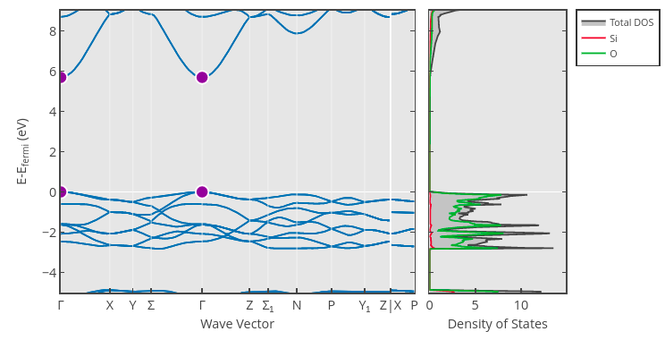
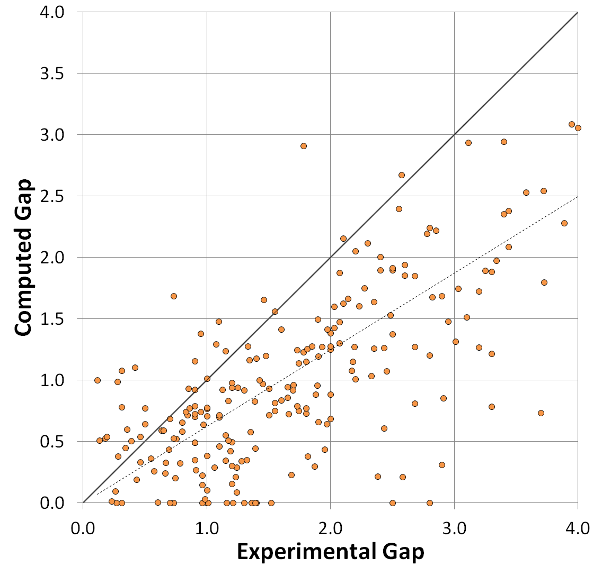

---
jupytext:
  text_representation:
    extension: .md
    format_name: myst
kernelspec:
  display_name: Python 3
  language: python
  name: python3
---

# Application: Bandgap Prediction

Let's now try to tackle a more difficult regression problem: predicting material bandgaps. The bandgap of a material is an important property related to whether or not a material is a conductor: Materials with a zero bandgap are typically conductors, whereas materials with a positive bandgap are insulators (if the gap is large) or semiconductors (if the gap is small). We can estimate the bandgap by examining the largest gap between the energies of two states in the material's _band structure_. For example, the bandgap of one crystalline phase of the insulator SiO$_2$ [(mp-546794)](https://next-gen.materialsproject.org/materials/mp-546794?formula=SiO2) is roughly 5.69 eV, which is the difference in band energy at the $\Gamma$ point (shown in purple):



## Bandgap Dataset

The band gap can be estimated through _ab initio_ calculation methods, such as _density functional theory_ (DFT). In this section, we will use band gap values estimated through DFT calculations as reported in the Materials Project Database.

:::{admonition} Notes about Bandgap Estimation and DFT
:class: important, dropdown
For more information on how bandgaps are estimated in the Materials Project, see the [Electronic Structure](https://docs.materialsproject.org/methodology/materials-methodology/electronic-structure) documentation page. Take particular note of the "Computed Gap" versus "Experimental Gap" plot, which reflects a mean absolute error of 0.6 eV:



(There are some methods in DFT that can correct for this, such as the [PBE0 model](https://pubs.aip.org/aip/jcp/article/110/13/6158/476177/Toward-reliable-density-functional-methods-without) or the [GW approach](https://journals.aps.org/pr/abstract/10.1103/PhysRev.139.A796), but neither of these appear to be used in the Materials Project).

In short, this means that we must be very careful if we want to apply our models from this section to make predictions of real bandgaps measured through experiment, especially insulators with large bandgaps.
:::

You can download the dataset for this section using the following Python code:

```
import requests

CSV_URL = 'https://raw.githubusercontent.com/cburdine/materials-ml-workshop/main/MaterialsML/regression/bandgaps.csv'

r = requests.get(CSV_URL)
with open('bandgaps.csv', 'w', encoding='utf-8') as f:
    f.write(r.text)
```

Alternatively, you can download the CSV file directly [here](https://raw.githubusercontent.com/cburdine/materials-ml-workshop/main/MaterialsML/regression/bandgaps.csv).

## Loading the Dataset

To start, let's load the dataset into a Pandas dataframe and view it:

```{code-cell}
:tags: [hide-input]
import pandas as pd

# load dataset into a pandas DataFrame:
BANDGAP_CSV = 'bandgaps.csv'
data_df = pd.read_csv(BANDGAP_CSV)

# show dataframe in notebook:
display(data_df)
```

There are several different features included in this dataset. Here's a summary of the included features:

* _mp_id_: Materials Project ID of material
* _formula_: Chemical formula
* _composition_: Composition of the material in the unit cell (as a Python `dict`)
* _crystal_system_: Crystal system of the material
* _symetry_symbol_: Space group symbol of crystal structure
* _volume_: Unit cell volume (Å$^3$)
* _density_: Density of material (g/cm$^3$)
* _e_fermi_: Fermi energy (relative to calculated band structure) (eV)
* _formation_energy_per_atom_: Formation energy per unit cell atom (eV/atom)
* _bandgap_: Estimated bandgap of the material (eV)
* _bandgap_direct_: Whether or not the estimated bandgap is direct.

The most important features that uniquely identify each material in the dataset are the composition and crystal system of each material. If we want to include this as a feature in a supervised model, we must find a way to convert these feature to a numerical vector. Let's start by listing all of the elements and crystal systems in the dataset:

```{code-cell}
:tags: [hide-input]

# Generate a list of elements in the dataset:
ELEMENTS = set()
for v in data_df['composition'].values:
    ELEMENTS |= set(eval(v).keys())
ELEMENTS = sorted(ELEMENTS)

# Generate a list of the crystal systems in the dataset:
CRYSTAL_SYSTEMS = sorted(set(data_df['crystal_system']))

# print the sizes of ELEMENTS and CRYSTAL_SYSTEMS
print('Number of elements:', len(ELEMENTS))
print('Number of crystal systems:', len(CRYSTAL_SYSTEMS))
```
We see that there are 86 elements represented in the dataset and 7 different crystal systems. The simplest way of converging the composition of each material to a vector is by representing it as a "bag of atoms", that is, by converting the composition to a vector with 86 entries (representing the 86 elements present in the data) where the entry of each vector represents the fraction of the unit cell occupied by the corresponding element.

We can also represent the crystal system of each material as a vector with seven entries, where only the value corresponding to the crystal system is set to 1. The remaining entries of this vector are set to 0. Below, we write Python functions to vectorize the material composition and the crystal system:

```{code-cell}
import numpy as np

def vectorize_composition(composition, elements):
    """ converts an elemental composition dict to a vector. """
    total_n = sum(composition.values())
    vec = np.zeros(len(elements))
    for elem, n in composition.items():
        if elem in elements:
            vec[elements.index(elem)] = n/total_n
    return vec

def vectorize_crystal_system(crystal_system, systems):
    """ converts a crystal system to a vector. """
    vec = np.zeros(len(systems))
    if crystal_system in systems:
        vec[systems.index(crystal_system)] = 1.0
        
    return vec
```

Below, we give some examples of how this vectorization procedure works for compositions and crystal systems:

```{code-cell}:
:tags: [hide-input]
# generate an example of a composition vector:
test_comp = {'Si': 1, 'O': 2}
print('Example of a composition vector:')
print(vectorize_composition(
            test_comp, 
            elements=['C', 'O', 'Si']))

# generate an example of a crystal system vector:
test_system = 'Hexagonal'
print('Example of a crystal system vector:')
print(vectorize_crystal_system(
            test_system, 
            systems=['Cubic', 'Hexagonal']))
```

Next, let's write a function that extracts features from each row in the dataframe and constructs each material's feature vector $\mathbf{x}$ and label vector $\mathbf{y}$. The feature vector $\mathbf{x}$ will contain the following values combined into a single vector:

* The material's "bag of atoms" composition vector
* The material's crystal system vector
* The material's unit cell volume
* The material's density
* The material's formation energy per atom

The label vector $\mathbf{y}$ for each material will contain two values: the band gap of the material (in eV) and a value of $\pm 1$ indicating if the band gap is direct or indirect.

```{code-cell}
def parse_data_vector(row):
    """ parses x and y vectors from a dataframe row """
    
    # parse whether or not the bandgap is direct: 
    bandgap_direct = 1.0 if row['bandgap_direct'] else -1.0
    
    # parse the composition dict:
    composition_dict = eval(row['composition'])
    
    # parse feature vector (x):
    x_vector = np.concatenate([
        vectorize_composition(composition_dict, ELEMENTS),
        vectorize_crystal_system(row['crystal_system'], CRYSTAL_SYSTEMS),
        np.array([ row['volume'] ]),
        np.array([ row['density'] ]),
        np.array([ row['formation_energy_per_atom'] ]),
    ])
    
    # parse label vector (y):
    y_vector = np.concatenate([
        np.array([ row['band_gap'] ]),
        np.array([ bandgap_direct ])
    ])
    
    return x_vector, y_vector
```

Next, we will iterate over each row in the dataframe and apply the `parse_data_vector()` function to extract the $\mathbf{x}$ and $\mathbf{y}$ vectors from the dataset. We will take the list of all $\mathbf{x}$ and $\mathbf{y}$ vectors and convert them into a pair of numpy arrays:

```{code-cell}
:tags: [hide-input]

# parse x and y vectors from dataframe rows:
data_x, data_y = [], []
for i, row in data_df.iterrows():
    x_vector, y_vector = parse_data_vector(row)
    data_x.append(x_vector)
    data_y.append(y_vector)

# convert x and y to numpy arrays:
data_x = np.array(data_x)
data_y = np.array(data_y)

print('data_x shape:', data_x.shape)
print('data_y shape:', data_y.shape)
```

Now that we have parsed features from the dataset, let's write some functions that will automatically split data into training, validation, and test set. We may also find it useful to write a function that standardizes these sets as well:

```{code-cell}
from sklearn.preprocessing import StandardScaler
from sklearn.model_selection import train_test_split

def train_val_test_split(data_x, data_y, split=(0.8,0.1,0.1)):
    """ splits data into train, validation, and test sets. """
    
    # split train and nontrain data:
    train_x, nontrain_x, train_y, nontrain_y = \
        train_test_split(
            data_x, data_y, train_size=split[0]/sum(split))
    
    # split validation and test data:
    val_x, test_x, val_y, test_y = \
        train_test_split(
            data_x, data_y, 
            test_size=split[2]/(split[1]+split[2]))
    
    return (train_x, val_x, test_x), \
           (train_y, val_y, test_y)
    
def standardize(train_x, val_x, test_x):
    """ standardizes a dataset. """
    
    scaler = StandardScaler()
    train_z = scaler.fit_transform(train_x)
    val_z = scaler.transform(val_x)
    test_z = scaler.transform(test_x)
    return scaler, train_z, val_z, test_z

```
## Classifying Metals and Non-Metals

The first supervised learning problem we will examine is discriminating between materials with a bandgap that is zero (i.e. metals) and materials with a bandgap that is nonzero (i.e. insulators). We will start by creating a vector of $y$ values with values of $\pm 1$ indicating whether a material is a metal or nonmetal:

```{code-cell}
metals_y = np.array([ 1.0 if y[0] <= 0 else -1 for y in data_y])

metal_subsets_x, metal_subsets_y = \
    train_val_test_split(data_x, metals_y)

train_x, val_x, test_x = metal_subsets_x
train_y, val_y, test_y = metal_subsets_y

scaler, train_z, val_z, test_z = \
    standardize(train_x, val_x, test_x)
```

It's usually best to start by seeing how well a simple models such as a linear classifier fits the data. We could use a linear classifier (also known as a _Perceptron_) like we did in the last application section. Since we now know about how regularization can sometimes improve the validation accuracy of a linear model, let's use a _ridge regression linear classifier_ that is equipped with a regularization parameter $\lambda$. When $\lambda = 0$, (no regularization is applied) the model is identical to a linear classifier. Scikit-learn provides an implementation of this with [`sklearn.linear_model.RidgeClassifier`](https://scikit-learn.org/stable/modules/generated/sklearn.linear_model.RidgeClassifier.html#sklearn.linear_model.RidgeClassifier). (Note that in sklearn, the regularization parameter $\lambda$ is referred to as $\alpha$) After fitting the model, we can also use scikit-learn's ConfusionMatrix class to visualize the kinds of classification errors made by our model on the validation set:


```{code-cell}
:tags: [hide-input]
from sklearn.linear_model import RidgeClassifier
from sklearn.metrics import confusion_matrix, ConfusionMatrixDisplay
import matplotlib.pyplot as plt

model = RidgeClassifier(alpha=20)
model.fit(train_z, train_y)

train_yhat = model.predict(train_z)
val_yhat = model.predict(val_z)

# compute accuracy:
cm = confusion_matrix(val_y, val_yhat)

# display confusion matrix:
disp = ConfusionMatrixDisplay(confusion_matrix=cm,
                              display_labels=model.classes_)
disp.plot()
plt.gca().set_yticklabels(['Non Metal', 'Metal'])
plt.gca().set_xticklabels(['Non Metal', 'Metal'])
plt.show()
```

From inspecting the confusion matrix, we see that a significant majority of the materials were classified correctly, with almost three times as many metals being predicted as non-metals than non-metals being predicted as metals. We can evaluate the overall validation set accuracy of the model from the confusion matrix as follows:

```{code-cell}
accuracy = np.sum(np.diag(cm)) / np.sum(cm)
print(accuracy)
```

## Estimating the Bandgap of Non-Metals:

We have shown that we can classify materials as metals or non-metals with accuracy close to 90%. The next problem we will consider is estimating the bandgap of materials that are either known to be non-metals or are classified by the previous model as such. Let's start by extracting all non-metallic materials with nonzero bandgaps:

```{code-cell}
:tags: [hide-input]
bandgap_x = data_x[data_y[:,0] > 0]
bandgap_y = data_y[(data_y[:,0] > 0),0]

print('bandgap_x shape:', bandgap_x.shape)
print('bandgap_y shape:', bandgap_y.shape)
```

We standardize this data with the following code:

```{code-cell}
bandgap_subsets_x, bandgap_subsets_y = \
    train_val_test_split(bandgap_x, bandgap_y)

train_x, val_x, test_x = bandgap_subsets_x
train_y, val_y, test_y = bandgap_subsets_y

scaler, train_z, val_z, test_z = \
    standardize(train_x, val_x, test_x)
```

## Ridge Regression Model:

Since predicting the bandgap is a regression problem, a good model to start with is ridge regression. We will use [`sklearn.linear_model.Ridge`](https://scikit-learn.org/stable/modules/generated/sklearn.linear_model.Ridge.html#sklearn-linear-model-ridge):

```{code-cell}
:tags: [hide-input]
from sklearn.linear_model import Ridge

# construct a rigde regression model:
ridge_model = Ridge(alpha=0.01)
ridge_model.fit(train_z, train_y)

train_yhat = ridge_model.predict(train_z)
val_yhat = ridge_model.predict(val_z)

# evaluate the MSE on the training/validation sets:
train_mse = np.mean((train_yhat - train_y)**2)
val_mse = np.mean((val_yhat - val_y)**2)

# evaluate the training/validation error:
print('training stddev:', np.std(train_y))
print('training MSE:', train_mse)
print('validation MSE:', val_mse)
print('validation RMSE/stddev:', np.sqrt(val_mse)/np.std(train_y))
```

While a model root mean square error (RMSE) that is roughly half of the standard deviation is likely be a statistically significant improvement upon random guessing, it leaves much to be desired. Let's try a more complex model: _Gradient Boosting Regression_. Since our dataset is quite large, it may also be more computationally efficient to use the _histogram_ variant, which is implemented in [`sklearn.ensemble.HistGradientBoostingRegressor`](https://scikit-learn.org/stable/modules/generated/sklearn.ensemble.HistGradientBoostingRegressor.html#sklearn-ensemble-histgradientboostingregressor):

## Gradient Boosting Regression

```{code-cell}
:tags: [hide-input]

from sklearn.ensemble import HistGradientBoostingRegressor

# Construct a histogram gradient boosting model:
hgbr = HistGradientBoostingRegressor(
    loss='squared_error',
    learning_rate=0.1,
    max_leaf_nodes=128,
)
hgbr.fit(train_z, train_y)

# make predictions on the training/validation sets:
train_yhat = hgbr.predict(train_z)
val_yhat = hgbr.predict(val_z)

# evaluate the MSE on the training/validation sets:
train_mse = np.mean((train_yhat - train_y)**2)
val_mse = np.mean((val_yhat - val_y)**2)

# print the training/validation error
print('training stddev:', np.std(train_y))
print('training MSE:', train_mse)
print('validation MSE:', val_mse)
print('validation RMSE/stddev:', np.sqrt(val_mse)/np.std(train_y))
```

This is a significant improvement upon the Ridge regression model. Let's also see how well a support vector regression (SVR) model works for bandgap estimation when we use the radial basis function (RBF) kernel. We will use [`sklearn.svm.SVR`](https://scikit-learn.org/stable/modules/generated/sklearn.svm.SVR.html#sklearn.svm.SVR). Take note that SVR models may take a few minutes to fit to large datasets:

### RBF Support Vector Regression
```
from sklearn.svm import SVR

# construct an SVR with an rbf kernel:
svr_model = SVR(kernel='rbf', C=200, epsilon=1e-3, cache_size=500)
svr_model.fit(train_z, train_y)

# make predictions on the train/validation/test sets:
train_yhat = svr_model.predict(train_z)
val_yhat = svr_model.predict(val_z)
test_yhat = svr_model.predict(test_z)

# evaluate the MSE on the train/validation/test sets:
train_mse = np.mean((train_yhat - train_y)**2)
val_mse = np.mean((val_yhat - val_y)**2)
test_mse = np.mean((test_yhat - test_y)**2)

# print the training/validation error:
print('# of support vectors:', svr_model.n_support_) 
print('training stddev:', np.std(train_y))
print('training MSE:', train_mse)
print('validation MSE:', val_mse)
print('validation RMSE/stddev:', np.sqrt(val_mse)/np.std(train_y))

# print the test error:
print('test MSE:', test_mse)
print('test RMSE/stddev: ', np.sqrt(test_mse)/np.std(train_y))
```

```
# of support vectors: [9152]
training stddev: 0.8640814456704967
training MSE: 0.01842750045837074
validation MSE: 0.10748327182498967
validation RMSE/stddev: 0.37941610323604913
test MSE: 0.1108143968686793
test RMSE/stddev:  0.38525067990691425
```

## Exercises

:::{dropdown} Exercise 1: Classifying Direct vs. Indirect Bandgaps

Let's apply the same techniques we used to classify metallic versus insulating materials to estimate whether a bandgapped material has a direct or indirect bandgap. We can extract the $\mathbf{x}$ and $y$ dataset for this task using the following code:

```
direct_gap_x = data_x[data_y[:,0] > 0]
direct_gap_y = data_y[(data_y[:,0] > 0),1]

print('direct_gap_x shape:', direct_gap_x.shape)
print('direct_gap_y shape:', direct_gap_y.shape)
```

Split this data into training, validation, and test sets. Then, fit a ridge classifier (or another model you think may perform well on this task) to the training set. Visualize the fitted model's accuracy on a validation set by plotting a confusion matrix. Once you have found a model with acceptable accuracy, evaluate the final accuracy of the model using the test set.

---
_Hint_: Note that you can obtain the accuracy of a classification model in `sklearn` using the `model.score(x,y)` function.

:::

### Solutions

#### Exercise 1: Classifying Direct vs. Indirect Bandgaps

```{code-cell}
:tags: [hide-cell]

import numpy as np
from sklearn.linear_model import RidgeClassifier
from sklearn.metrics import confusion_matrix, ConfusionMatrixDisplay
import matplotlib.pyplot as plt

# get direct bandgap data for materials with nonzero gaps:
direct_gap_x = data_x[data_y[:,0] > 0]
direct_gap_y = data_y[(data_y[:,0] > 0),1]

# split data in train/test/validation sets:
direct_subsets_x, direct_subsets_y = \
    train_val_test_split(direct_gap_x, direct_gap_y)
train_x, val_x, test_x = direct_subsets_x
train_y, val_y, test_y = direct_subsets_y

# standardize data:
scaler, train_z, val_z, test_z = \
    standardize(train_x, val_x, test_x)

# fit a ridge classifier to the data:
direct_ridge_model = RidgeClassifier(alpha=20)
direct_ridge_model.fit(train_z, train_y)

# make predictions on the validation & test sets:
val_yhat = direct_ridge_model.predict(val_z)
test_yhat = direct_ridge_model.predict(test_z)

# compute accuracy:
cm = confusion_matrix(val_y, val_yhat)

# display validation set confusion matrix:
disp = ConfusionMatrixDisplay(confusion_matrix=cm,
                              display_labels=model.classes_)
disp.plot()
plt.gca().set_yticklabels(['Direct', 'Indirect'])
plt.gca().set_xticklabels(['Direct', 'Indirect'])
plt.show()

# print validation set accuracy and test set accuracy:
val_acc = direct_ridge_model.score(val_z, val_y)
test_acc = direct_ridge_model.score(test_z, test_y)
print('validation set accuracy:', val_acc)
print('test set accuracy:', test_acc)

```
