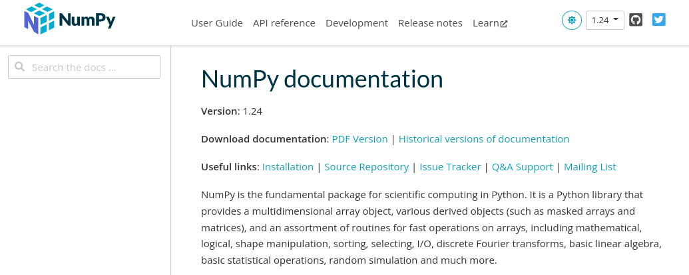

---
jupytext:
  formats: md:myst
  text_representation:
    extension: .md
    format_name: myst
    format_version: 0.13
    jupytext_version: 1.14.6
kernelspec:
  display_name: Python 3
  language: python
  name: python3
---

# Scientific Computing with Numpy and Scipy

Now that we have covered some of the built-in functionality of Python, it's time to start learning about some of the powerful functionality provided by the `numpy` and `scipy` Python packages. `numpy` and `scipy` are two popular scientific computing packages that provide tools for numerical computation, data manipulation, and scientific analysis. These packages provide some of the essential functionality that we will use extensively throughout the rest of this workshop.

## Python Packages

In order to use these Python packages, we must first make sure that the package is installed in our Python environment. The quickest way to check if a package is properly installed is to try to import it into our Python code with an `import` statement. Let's try to import the `numpy` and `scipy` base packages by putting the following two lines in the first cell of our notebook:

```{code-cell}
# import packages:
import numpy
import scipy
```

:::{important} 
If a package is not correctly installed on your system, attempting to import it will raise a `ModuleNotFoundError`.
In the {doc}`../python/getting_started` section, we give additional details about how to install all needed dependencies for this workshop in your Python environment.
:::

If importing the package did not create an error, the package was installed correctly. In our Python code, we typically put `import` statements at the very top, so that all of the packages used in our code are imported at the very beginning. We will be using the `numpy` package a lot in this workshop. So, to avoid typing `numpy.<function>` whenever we want to use a function in the numpy package, we will import `numpy` with the shortened alias `np`. To do this, we replace the `import numpy` statement with the following:

```{code-cell}
# imports the numpy package with the alias 'np':
import numpy as np
```

This allows us to use `numpy` functions as follows:

```
# call the numpy.sqrt (square root) function:
x = np.sqrt(2)
```
When using the `scipy` package, we will often import functions only as we need them. This will avoid unnecessarily importing the entire base package. For example, to integrate a function, we might want to import the `scipy.integrate.quad` function

```{code-cell}
# imports the scipy.integrate.quad function as `quad`
from scipy.integrate import quad
```

Using the `quad` function we imported, we can numerically evaluate the integral

$$\int_{0}^1 x^2\ dx = 1/3$$

using the following code:
```{code-cell}
# define f = x^2
def f(x):
    return x**2

# numerically integrate f from 0 to 1:
result, err = quad(f,0,1)
print(result)
```

## Reading Package Documentation

When working with a package for the first time, it it often helpful to familiarize yourself with the package's online documentation (almost all of the popular Python packages have online documentation avaliable). Most of the time, you can find the online documentation by typing the name of the package into your web browser's search engine. For example, the [online documentation website for `numpy`](https://numpy.org/doc/stable/index.html) looks like:



Getting familiar with how to navigate the online documentation is crucial if you want to understand the various features and functions available to use in a Python package.

## Exercises

:::{dropdown} Exercise 1: Numpy Online Documentation 

Take a look at the Numpy package documentation at [https://numpy.org/doc/stable/index.html](https://numpy.org/doc/stable/index.html) and click on "API reference" and briefly skim through some pages of online documentation. 

Search for the documentation on the `numpy.sqrt` function that we used above. Scroll down to where there are examples given on the usage of the `sqrt` function. Copy and paste the code in these examples and execute them in your notebook to better understand how the function works.
:::

:::{dropdown} Exercise 2: Scipy Online Documentation

Repeat Exercise 1, but do a search for the `scipy.integrate.quad` function in the Scipy online documentation, which can be found at [https://docs.scipy.org/doc/scipy/](https://docs.scipy.org/doc/scipy/).
:::

